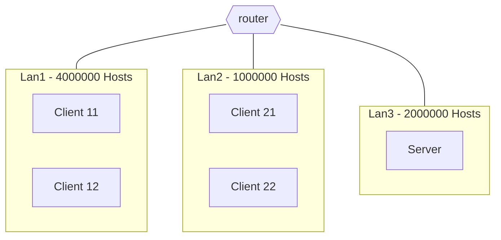
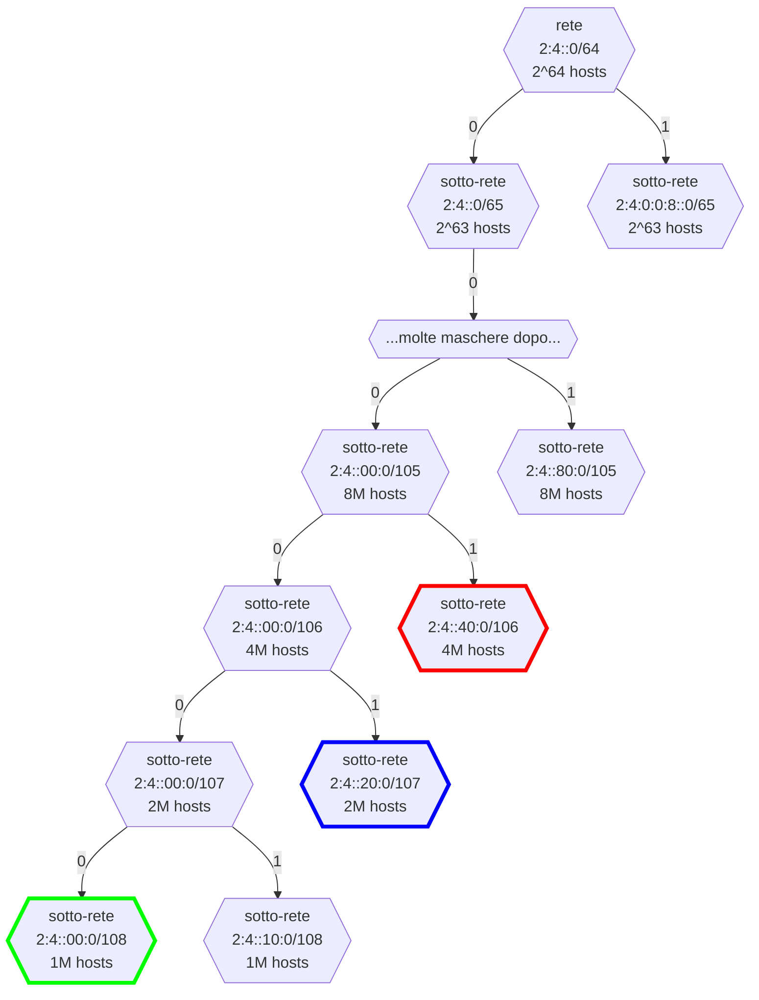
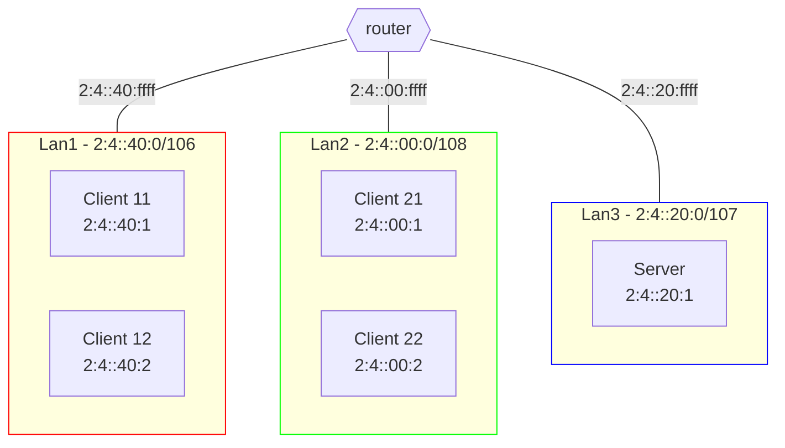

# Caffè Sbagliato

## Definizione dello scenario

### Progettazione della topologia

Configurare la rete secondo lo schema riportato in figura.
Gli indirizzi IPv6 da utilizzare sono nel range $2:4::0/64$.
Si supponga che

- Lan1 sia in grado di ospitare fino a 4.000.000 Hosts.
  - Due **client** appartengono a questa rete
- Lan2 sia in grado di ospitare fino a 1.000.000 Hosts.
  - Due **client** appartengono a questa rete
- Lan3 sia in grado di ospitare fino a 2.000.000 Hosts.
  - Il **server** appartiene a questa rete



[Soluzione](#soluzione-progettazione-della-topologia)

### Realizzazione del networking

Dopo aver abbozzato la topologia su carta, si realizzi il networking definito in precedenza con delle macchine virtuali.  
Le macchine devono essere in grado di pingare tutte le altre.
È necessario che siano presenti

- almeno 1 macchina nella Lan1
- almeno 1 macchina nella Lan2
- 1 macchina nella Lan3
- 1 router che metta in comunicazione tutte le Lan

[Soluzione](#soluzione-realizzazione-del-networking)

### Programmazione Socket

Gli studenti di informatica del corso di Reti di Calcolatori hanno deciso di implementare un sistema centralizzato per una nuova gestione delle macchinette del caffè del DMI posizionate nei vari blocchi (1.2).
Un generico client (che sarà associato a una specifica LAN in base al blocco di appartenenza), si collegherà al server Caffe Sbagliato DMI (stabilirà una concessione) ed effettuerà, in modo sequenziale le seguenti operazioni:

1. Il client riceverà (dal server) l'elenco di tutti i prodotti disponibili.
   Il client visualizzerà i prodotti secondo il seguente schema:
   - `ID prodotto_1, Nome_Prodotto_1, Prezzo_1, Quantità_1`
   - `ID prodotto 2, Nome Prodotto_2, Prezzo_2, Quantita_2`
   - `...`
   - `ID prodotto_N, Nome_Prodotto_N, Prezzo_N, Quantità_N`
2. Il client, invierà la seguente stringa, contenente il prodotto scelto:
   - `ID prodotto, quantità`
3. Il server sceglierà in modo casuale sia un prodotto diverso che una quantità differente rispetto quello scelto dall'utente.
   Il server restituirà il nome del prodotto erogato e la relativa quantità.
   Infine, il server aggiornerà la quantità disponibile per quel prodotto.
4. Il client inserirà il carattere "c" per continuare (in questo caso si riparte dal punto 1), oppure il carattere "q" per concludere l'acquisto (in questo caso la connessione con il server si concluderà).

**Usare Socket TCP.**

> [!Note]  
> Lo studente può definire qualsiasi approccio per risolvere l'esercizio.

---

## Soluzioni

> [!Note]  
> Prima di leggere le soluzioni, provare a risolvere l'esercizio da soli.
> Dopo averlo fatto, confrontare la propria soluzione con quella proposta.
> Ci sono tantissimi modi per risolvere le varie consegne, quindi non c'è da preoccuparsi se la propria soluzione è diversa da quella proposta.

### Soluzione: Progettazione della topologia

Calcolo delle maschere necessarie per soddisfare i requisiti di ciascuna lan:

$$
\text{Lan1}: \lceil \log_2(4000000) \rceil = 22 \rightarrow 128 - 22 = 106 \\
\text{Lan2}: \lceil \log_2(1000000) \rceil = 20 \rightarrow 128 - 20 = 108 \\
\text{Lan3}: \lceil \log_2(2000000) \rceil = 21 \rightarrow 128 - 21 = 107
$$





### Soluzione: Realizzazione del networking

#### Client11

```shell
# Client11
ip -6 addr add 2:4::40:1/106
ip -6 route add default via 2:4::40:ffff
```

oppure

```py
# Client11
# nano /etc/network/interfaces
# ...
auto enp0s3
iface enp0s3 inet6 static
    address 2:4::40:1/106
    gateway 2:4::40:ffff

```

#### Client12

```shell
# Client12
ip -6 addr add 2:4::40:2/106
ip -6 route add default via 2:4::40:ffff
```

oppure

```py
# Client12
# nano /etc/network/interfaces
# ...
auto enp0s3
iface enp0s3 inet6 static
    address 2:4::40:2/106
    gateway 2:4::40:ffff
```

#### Client21

```shell
# Client21
ip -6 addr add 2:4::1/108
ip -6 route add default via 2:4::ffff
```

oppure

```py
# Client21
# nano /etc/network/interfaces
# ...
auto enp0s3
iface enp0s3 inet6 static
    address 2:4::1/108
    gateway 2:4::ffff

```

#### Client22

```shell
# Client22
ip -6 addr add 2:4::2/108
ip -6 route add default via 2:4::ffff
```

oppure

```py
# Client22
# nano /etc/network/interfaces
# ...
auto enp0s3
iface enp0s3 inet6 static
    address 2:4::2/108
    gateway 2:4::ffff
```

#### Server

```shell
# Server
ip -6 addr add 2:4::20:1/107
ip -6 route add default via 2:4::20:ffff
```

oppure

```py
# Server
# nano /etc/network/interfaces
# ...
auto enp0s3
iface enp0s3 inet6 static
    address 2:4::20:1/107
    gateway 2:4::20:ffff
```

#### Router1

```shell
# Router1
ip link set enp0s8 up
ip link set enp0s9 up
# Indirizzi ip del router
ip -6 addr add 2:4::40:ffff/106 dev enp0s3
ip -6 addr add 2:4::ffff/108 dev enp0s8
ip -6 addr add 2:4::20:ffff/107 dev enp0s9
# Forwarding
sysctl -w net.ipv6.conf.all.forwarding=1
```

oppure

```py
# Router1
# nano /etc/network/interfaces
# ...
auto enp0s3
iface enp0s3 inet6 static
    address 2:4::40:ffff/120

auto enp0s8
iface enp0s8 inet6 static
    address 2:4::ffff/108

auto enp0s9
iface enp0s8 inet6 static
    address 2:4::20:ffff/107
```

```py
# Router1
# nano /etc/sysctl.conf
net.ipv6.conf.all.forwarding=1
```

### Soluzione: Programmazione Socket

[server.c](./server.c)  
[client.c](./client.c)  
[azienda.c](./azienda.c)
