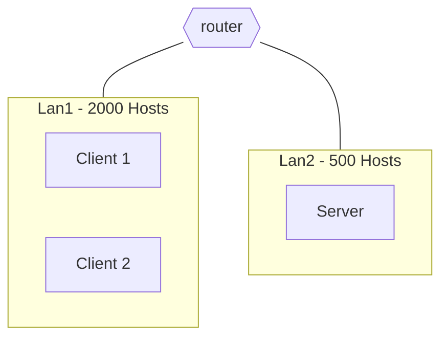
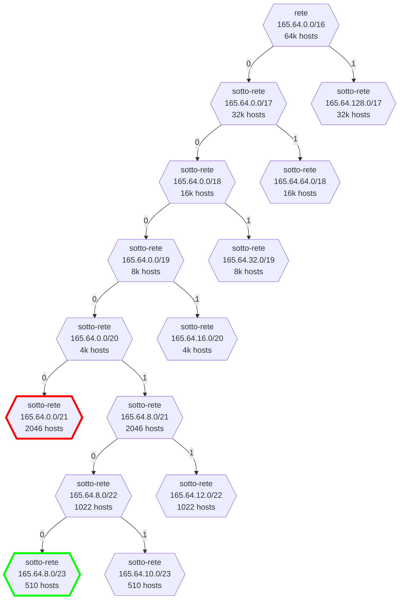
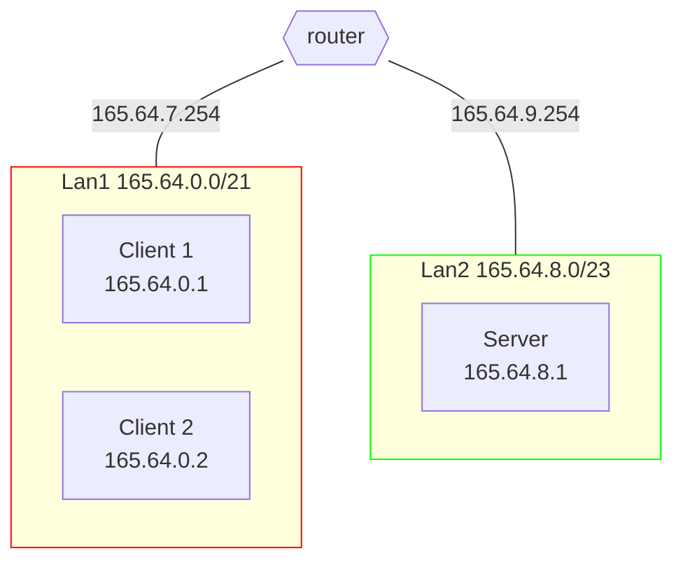

# Il pacchetto Christmas

## Definizione dello scenario

### Progettazione della topologia

Configurare la rete secondo lo schema riportato in figura. Gli indirizzi IPv4 da utilizzare sono nel range $165.64.0.0/16$.

- Lan1 sia in grado di ospitare fino a 2000 Hosts.
  - I due **client** appartengono a questa rete
- Lan2 sia in grado di ospitare fino a 500 Hosts.
  - Il **server** appartiene a questa rete



[Soluzione](#soluzione-progettazione-della-topologia)

### Realizzazione del networking

Dopo aver abbozzato la topologia su carta, si realizzi il networking definito in precedenza con delle macchine virtuali.  
Le macchine devono essere in grado di pingare tutte le altre.
È necessario che siano presenti

- 2 macchine nella Lan 1
- 1 macchina nella Lan 2
- 1 router che metta in comunicazione le due Lan

[Soluzione](#soluzione-realizzazione-del-networking)

### Programmazione Socket

Gli studenti di informatica del corso di Reti di Calcolatori hanno deciso di implementare un server Christmas in grado di ricevere e gestire bigliettini di Natale contenenti messaggi del tipo "Oggi supererò il laboratorio di Reti".  
Un generico client avrà la possibilità di:

- inviare un messaggio al server
- fare una richiesta per ricevere tutti i messaggi già inviati (solo dello specifico client).
- modificare e/o cancellare un messaggio specifico.

Il server dovrà essere progettato in modo da memorizzare qualsiasi messaggio (associandolo allo specifico client) e gestire le operazioni precedentemente elencate.
Quando il client invierà il carattere `q`, il programma (per lo specifico client) terminerà.

Si utilizzino le Socket **UDP** per la comunicazione.

> **Nota**  
> Lo studente può definire qualsiasi approccio per risolvere l'esercizio.

[Soluzione](#soluzione-programmazione-socket)

---

## Soluzioni

> **Note**  
> Prima di leggere le soluzioni, provare a risolvere l'esercizio da soli.
> Dopo averlo fatto, confrontare la propria soluzione con quella proposta.
> Ci sono tantissimi modi per risolvere le varie consegne, quindi non c'è da preoccuparsi se la propria soluzione è diversa da quella proposta.

### Soluzione: Progettazione della topologia



---



### Soluzione: Realizzazione del networking

#### Client1

```shell
# Client1
ip addr add 165.64.0.1/21
ip route add default via 165.64.7.254
```

oppure

```py
# Client1
# nano /etc/network/interfaces
# ...
auto enp0s3
iface enp0s3 inet static
    address 165.64.0.1/21
    gateway 165.64.7.254

```

#### Client2

```shell
# Client2
ip addr add 165.64.0.2/21
ip route add default via 165.64.7.254
```

oppure

```py
# Client2
# nano /etc/network/interfaces
# ...
auto enp0s3
iface enp0s3 inet static
    address 165.64.0.2/21
    gateway 165.64.7.254
```

#### Server

```shell
# Server
ip addr add 165.64.8.1/23
ip route add default via 165.64.9.254
```

oppure

```py
# Server
# nano /etc/network/interfaces
# ...
auto enp0s3
iface enp0s3 inet static
    address 165.64.8.1/23
    gateway 165.64.9.254
```

#### Router1

```shell
# Router1
ip link set enp0s8 up
# Indirizzi ip del router
ip addr add 165.64.7.254/21 dev enp0s3
ip addr add 165.64.9.254/23 dev enp0s8
# Forwarding
sysctl -w net.ipv4.ip_forward=1
```

oppure

```py
# Router1
# nano /etc/network/interfaces
# ...
auto enp0s3
iface enp0s3 inet static
    address 165.64.7.254/21

auto enp0s8
iface enp0s8 inet static
    address 165.64.9.254/23
```

```py
# Router1
# nano /etc/sysctl.conf
net.ipv4.ip_forward=1
```

### Soluzione: Programmazione Socket

[server.c](./server.c)  
[client.c](./client.c)
[definitions.h](./definitions.h)
