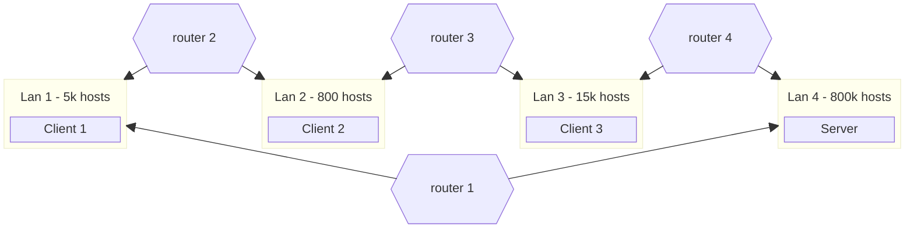
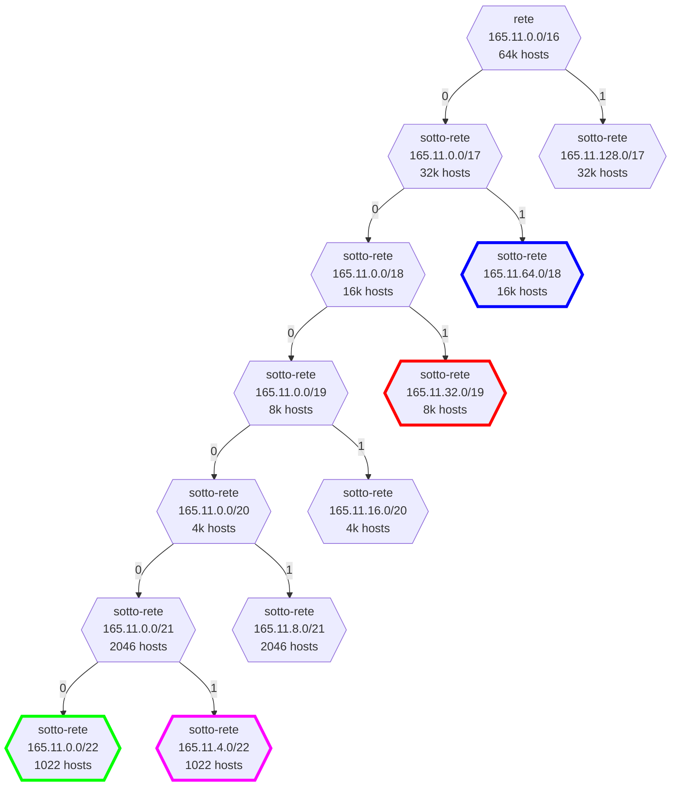
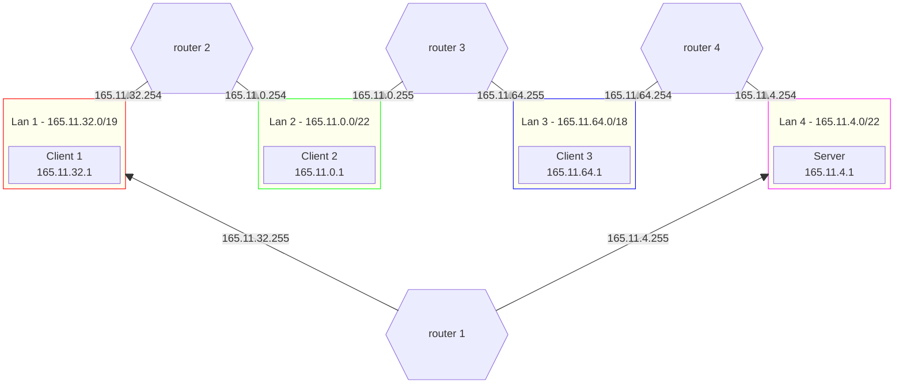

# Caffè Sbagliato

## Definizione dello scenario

### Progettazione della topologia

Configurare la rete secondo lo schema riportato in figura.
Gli indirizzi IPv4 da utilizzare sono nel range $165.11.0.0/16$.
Si supponga che

- Lan1 sia in grado di ospitare fino a 5k Hosts.
  - **Client1** appartiene a questa rete
- Lan2 sia in grado di ospitare fino a 800 Hosts.
  - **Client2** appartiene a questa rete
- Lan3 sia in grado di ospitare fino a 15k Hosts.
  - **Client3** appartiene a questa rete
- Lan4 sia in grado di ospitare fino a 800 Hosts.
  - **Server** appartiene a questa rete



[Soluzione](#soluzione-progettazione-della-topologia)

### Realizzazione del networking

Dopo aver abbozzato la topologia su carta, si realizzi il networking definito in precedenza con delle macchine virtuali.  
Le macchine devono essere in grado di pingare il server.
È necessario che siano presenti

[Soluzione](#soluzione-realizzazione-del-networking)

### Programmazione Socket

Gli studenti del corso di Reti di Calcolatori hanno deciso di implementare un tool per l'impresa "Cocco Bello" al fine di ottimizzare le vendite nelle spiagge libere di Catania.
L'impresa metterà a disposizione una sequenza di prodotti con prezzo e quantità a disposizione.
Un generico cliente richiederà la lista dei prodotti disponibili e potrà avere la possibilità di acquistare uno o piu prodotti specificandone la quantità.
Dopo l'acquisto di un prodotto, la relative quantità verrà aggiornata.
Il servizio deve prevedere la possibilità autenticare un utente prima dell'acquisto di un prodotto (_non necessariamente deve essere implementata la funzione di registrazione_).

**Usare Socket TCP.**

> [!Note]  
> Lo studente può definire qualsiasi approccio per risolvere l'esercizio.

---

## Soluzioni

> [!Note]  
> Prima di leggere le soluzioni, provare a risolvere l'esercizio da soli.
> Dopo averlo fatto, confrontare la propria soluzione con quella proposta.
> Ci sono tantissimi modi per risolvere le varie consegne, quindi non c'è da preoccuparsi se la propria soluzione è diversa da quella proposta.

### Soluzione: Progettazione della topologia

Calcolo delle maschere necessarie per soddisfare i requisiti di ciascuna lan:

$$
\begin{gather*}
\text{Lan1}: \lceil \log_2(5000) \rceil = 13 \rightarrow 32 - 13 = 19 \newline
\text{Lan2}: \lceil \log_2(800) \rceil = 10 \rightarrow 32 - 10 = 22 \newline
\text{Lan3}: \lceil \log_2(15000) \rceil = 14 \rightarrow 32 - 14 = 18 \newline
\text{Lan3}: \lceil \log_2(800) \rceil = 10 \rightarrow 32 - 10 = 22
\end{gather*}
$$



---



### Soluzione: Realizzazione del networking

#### Client1

```shell
# Client1
ip addr add 165.11.32.1/19
ip route add default via 165.11.32.255
```

oppure

```py
# Client1
# nano /etc/network/interfaces
# ...
auto enp0s3
iface enp0s3 inet static
    address 165.11.32.1/19
    gateway 165.11.32.255

```

#### Client2

```shell
# Client2
ip addr add 165.11.0.1/22
ip route add default via 165.11.0.255
```

oppure

```py
# Client2
# nano /etc/network/interfaces
# ...
auto enp0s3
iface enp0s3 inet static
    address 165.11.0.1/22
    gateway 165.11.0.255
```

#### Client 3

```shell
# Client3
ip addr add 165.11.64.1/18
ip route add default via 165.11.64.255
```

oppure

```py
# Client3
# nano /etc/network/interfaces
# ...
auto enp0s3
iface enp0s3 inet static
    address 165.11.64.1/18
    gateway 165.11.64.255
```

#### Server

```shell
# Server
ip addr add 165.11.4.1/22
ip route add default via 165.11.4.255
```

oppure

```py
# Server
# nano /etc/network/interfaces
# ...
auto enp0s3
iface enp0s3 inet static
    address 165.11.4.1/22
    gateway 165.11.4.255
```

#### Router1

```shell
# Router1
ip link set enp0s8 up
# Indirizzi ip del router
ip addr add 165.11.4.255/22 dev enp0s3
ip addr add 165.11.32.255/19 dev enp0s8
# Routing di default
ip route add default via 165.11.32.254
# Forwarding
sysctl -w net.ipv4.ip_forward=1
```

oppure

```py
# Router1
# nano /etc/network/interfaces
# ...
auto enp0s3
iface enp0s3 inet static
    address 165.11.4.255/22

auto enp0s8
iface enp0s8 inet static
    address 165.11.32.255/19
    gateway 165.11.32.254
```

```py
# Router1
# nano /etc/sysctl.conf
net.ipv4.ip_forward=1
```

#### Router2

```shell
# Router2
ip link set enp0s8 up
# Indirizzi ip del router
ip addr add 165.11.32.254/19 dev enp0s3
ip addr add 165.11.0.254/22 dev enp0s8
# Routing di default
ip route add default via 165.11.0.255
# Forwarding
sysctl -w net.ipv4.ip_forward=1
```

oppure

```py
# Router2
# nano /etc/network/interfaces
# ...
auto enp0s3
iface enp0s3 inet static
    address 165.11.32.254/19

auto enp0s8
iface enp0s8 inet static
    address 165.11.0.254/22
    gateway 165.11.0.255
```

```py
# Router1
# nano /etc/sysctl.conf
net.ipv4.ip_forward=1
```

#### Router3

```shell
# Router2
ip link set enp0s8 up
# Indirizzi ip del router
ip addr add 165.11.0.255/22 dev enp0s3
ip addr add 165.11.64.255/18 dev enp0s8
# Routing di default
ip route add default via 165.11.64.254
# Forwarding
sysctl -w net.ipv4.ip_forward=1
```

oppure

```py
# Router2
# nano /etc/network/interfaces
# ...
auto enp0s3
iface enp0s3 inet static
    address 165.11.0.255/22

auto enp0s8
iface enp0s8 inet static
    address 165.11.64.255/18
    gateway 165.11.64.254
```

```py
# Router1
# nano /etc/sysctl.conf
net.ipv4.ip_forward=1
```

#### Router4

```shell
# Router2
ip link set enp0s8 up
# Indirizzi ip del router
ip addr add 165.11.64.254/18 dev enp0s3
ip addr add 165.11.4.254/22 dev enp0s8
# Routing di default
ip route add default via 165.11.4.255
# Forwarding
sysctl -w net.ipv4.ip_forward=1
```

oppure

```py
# Router2
# nano /etc/network/interfaces
# ...
auto enp0s3
iface enp0s3 inet static
    address 165.11.64.254/18

auto enp0s8
iface enp0s8 inet static
    address 165.11.4.254/22
    gateway 165.11.4.255
```

```py
# Router1
# nano /etc/sysctl.conf
net.ipv4.ip_forward=1
```

### Soluzione: Programmazione Socket

[server.c](./server.c)  
[client.c](./client.c)  
[definitions.h](./definitions.h)
