# Enoteca

## Definizione dello scenario

### Progettazione della topologia

Configurare la rete secondo lo schema riportato in figura. Gli indirizzi IPv6 da utilizzare sono nel range $2:3::0/64$.

- Lan1 sia in grado di ospitare fino a 228 Hosts.
  - I **client-client** appartengono a questa rete
- Lan2 sia in grado di ospitare fino a 1032 Hosts.
  - I **client-azienda** appartengono a questa rete
- Lan3 sia in grado di ospitare fino a 960 Hosts.
  - Il **server** appartiene a questa rete



[Soluzione](#soluzione-progettazione-della-topologia)

### Realizzazione del networking

Dopo aver abbozzato la topologia su carta, si realizzi il networking definito in precedenza con delle macchine virtuali.  
Le macchine devono essere in grado di pingare tutte le altre.
È necessario che siano presenti

- 2 macchine nella Lan 1
- 2 macchine nella Lan 2
- 1 macchina nella Lan 3
- i 3 router

[Soluzione](#soluzione-realizzazione-del-networking)

### Programmazione Socket

L'azienda Rete Enoteca ha deciso di sviluppare una piattaforma per la vendita di vini da differenti aziende.  
I **client-azienda** dovranno inviare i prodotti disponibili della propria azienda al **server**.
In particolare, utilizzando un'apposita struttura articolo composta dai seguenti campi (_Nome Azienda, id_articolo, Nome Vino, Quantità, Costo_), per ogni articolo dovrà essere inviato
un pacchetto contenente le seguenti informazioni: _Nome Azienda, Nome Vino, Quantità, Costo_

> **Note**  
> Il campo _id_articolo_ (non presente nella lista di cui sopra) dovrà essere aggiunto dal **server** secondo una qualsiasi euristica definita a piacere
> Ogni azienda potrà richiedere al **sever** la propria lista dei vini disponibili, nonché aggiornare la quantità di un singolo articolo specificando l'_id_articolo_ e la _Quantità_.

I **client-client** avranno la possibili chiedere al **server** la lista dei prodotti presenti.
Enoteca. Quando il client deciderà di acquistare un articolo specifico, dovrà indicare l'_id_articolo_ e la _Quantità_.
In questo caso, il **server** dovrà verificare la quantità disponibile e, in caso positivo, decrementa quest'ultima dello specifico articolo.
Nel caso in cui la quantità richiesta non sia disponibile, il **server** invierà al **client** la quantità disponibile.

> **Note**  
> Lo studente può definire qualsiasi approccio al fine di distinguere i **client-client**
> dai **client-azienda**

> **Note**  
> È consigliato l'uso di un File di testo come _memoria condivisa_ per aggiornare e gestire tutte le operazioni sugli articoli di tutte le aziende.
> Ad ogni operazione di aggiunta e/o aggiornamento di quantità di un prodotto, verrà aggiornata la struttura articolo e di conseguenza il file di testo.
> Quindi, ogni volta che un client fa una richiesta, il Server- Enoteca aggiornerà la propria struttura con le informazioni disponibili nel file!

[Soluzione](#soluzione-programmazione-socket)

---

## Soluzioni

> **Note**  
> Prima di leggere le soluzioni, provare a risolvere l'esercizio da soli.
> Dopo averlo fatto, confrontare la propria soluzione con quella proposta.
> Ci sono tantissimi modi per risolvere le varie consegne, quindi non c'è da preoccuparsi se la propria soluzione è diversa da quella proposta.

### Soluzione: Progettazione della topologia


### Soluzione: Realizzazione del networking

#### Client1

```shell
# Client1
ip -6 addr add 2:3::1/120
ip -6 route add default via 2:3::ff
```

oppure

```py
# Client1
# nano /etc/network/interfaces
# ...
auto enp0s3
iface enp0s3 inet6 static
    address 2:3::1/120
    gateway 2:3::ff

```

#### Client2

```shell
# Client2
ip -6 addr add 2:3::2/120
ip -6 route add default via 2:3::ff
```

oppure

```py
# Client2
# nano /etc/network/interfaces
# ...
auto enp0s3
iface enp0s3 inet6 static
    address 2:3::2/120
    gateway 2:3::ff
```

#### Azienda1

```shell
# Azienda1
ip -6 addr add 2:3::801/117
ip -6 route add default via 2:3::fff
```

oppure

```py
# Azienda1
# nano /etc/network/interfaces
# ...
auto enp0s3
iface enp0s3 inet6 static
    address 2:3::801/117
    gateway 2:3::fff

```

#### Azienza2

```shell
# Azienda2
ip -6 addr add 2:3::802/117
ip -6 route add default via 2:3::fff
```

oppure

```py
# Azienda2
# nano /etc/network/interfaces
# ...
auto enp0s3
iface enp0s3 inet6 static
    address 2:3::802/117
    gateway 2:3::fff
```

#### Server

```shell
# Server
ip -6 addr add 2:3::401/118
ip -6 route add default via 2:3::7ff
```

oppure

```py
# Server
# nano /etc/network/interfaces
# ...
auto enp0s3
iface enp0s3 inet6 static
    address 2:3::401/118
    gateway 2:3::7ff
```

#### Router1

```shell
# Router1
ip link set enp0s8 up
# Indirizzi ip del router
ip -6 addr add 2:3::ff/120 dev enp0s3
ip -6 addr add 2:3::3fe/119 dev enp0s8
# Tabella di routing
ip -6 route add default via 2:3::3ff
# Forwarding
sysctl -w net.ipv6.conf.all.forwarding=1
```

oppure

```py
# Router1
# nano /etc/network/interfaces
# ...
auto enp0s3
iface enp0s3 inet6 static
    address 2:3::ff/120

auto enp0s8
iface enp0s8 inet6 static
    address 2:3::3fe/119
    gateway 2:3::3ff
```

```py
# Router1
# nano /etc/sysctl.conf
net.ipv6.conf.all.forwarding=1
```

#### Router2

```shell
# Router2
ip link set enp0s8 up
ip link set enp0s9 up
# Indirizzi ip del router
ip -6 addr add 2:3::7ff/118 dev enp0s3
ip -6 addr add 2:3::3ff/119 dev enp0s8
ip -6 addr add 2:3::11ff/119 dev enp0s9
# Tabella di routing
ip -6 route add 2:3::0/120 via 2:3::3fe
ip -6 route add 2:3::800/117 via 2:3::11fe
# Forwarding
sysctl -w net.ipv6.conf.all.forwarding=1
```

oppure

```py
# Router2
# nano /etc/network/interfaces
# ...
auto enp0s3
iface enp0s3 inet6 static
    address 2:3::7ff/118

auto enp0s8
iface enp0s8 inet6 static
    address 2:3::3ff/119
    up ip -6 route add 2:3::0/120 via 2:3::3fe

auto enp0s8
iface enp0s8 inet6 static
    address 2:3::11ff/119
    up ip -6 route add 2:3::800/117 via 2:3::11fe
```

```py
# Router2
# nano /etc/sysctl.conf
net.ipv6.conf.all.forwarding=1
```

#### Router3

```shell
# Router3
ip link set enp0s8 up
# Indirizzi ip del router
ip -6 addr add 2:3::fff/117 dev enp0s3
ip -6 addr add 2:3::11fe/119 dev enp0s8
# Tabella di routing
ip -6 route add default via 2:3::11ff
# Forwarding
sysctl -w net.ipv6.conf.all.forwarding=1
```

oppure

```py
# Router3
# nano /etc/network/interfaces
# ...
auto enp0s3
iface enp0s3 inet6 static
    address 2:3::fff/117

auto enp0s8
iface enp0s8 inet6 static
    address 2:3::11fe/119
    gateway 2:3::11ff
```

```py
# Router3
# nano /etc/sysctl.conf
net.ipv6.conf.all.forwarding=1
```

### Soluzione: Programmazione Socket

[server.c](./server.c)  
[client.c](./client.c)  
[azienda.c](./azienda.c)
