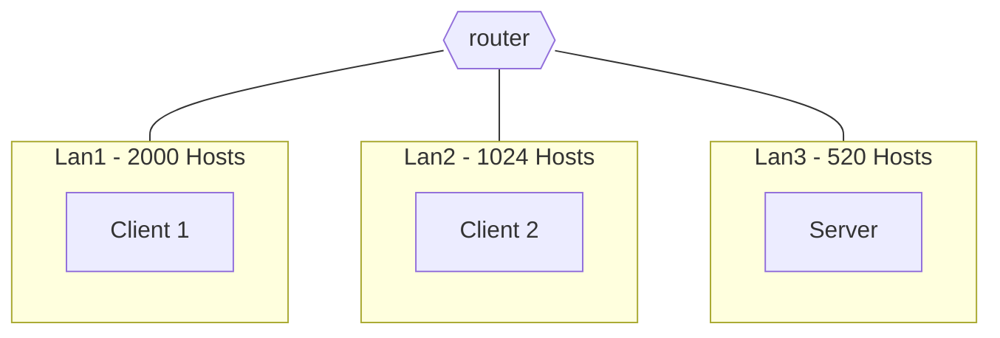
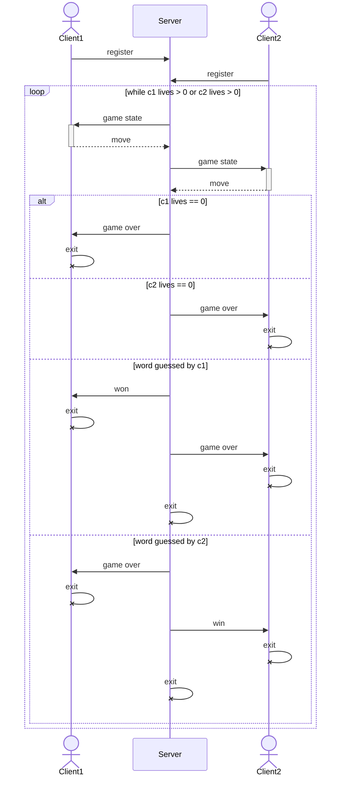
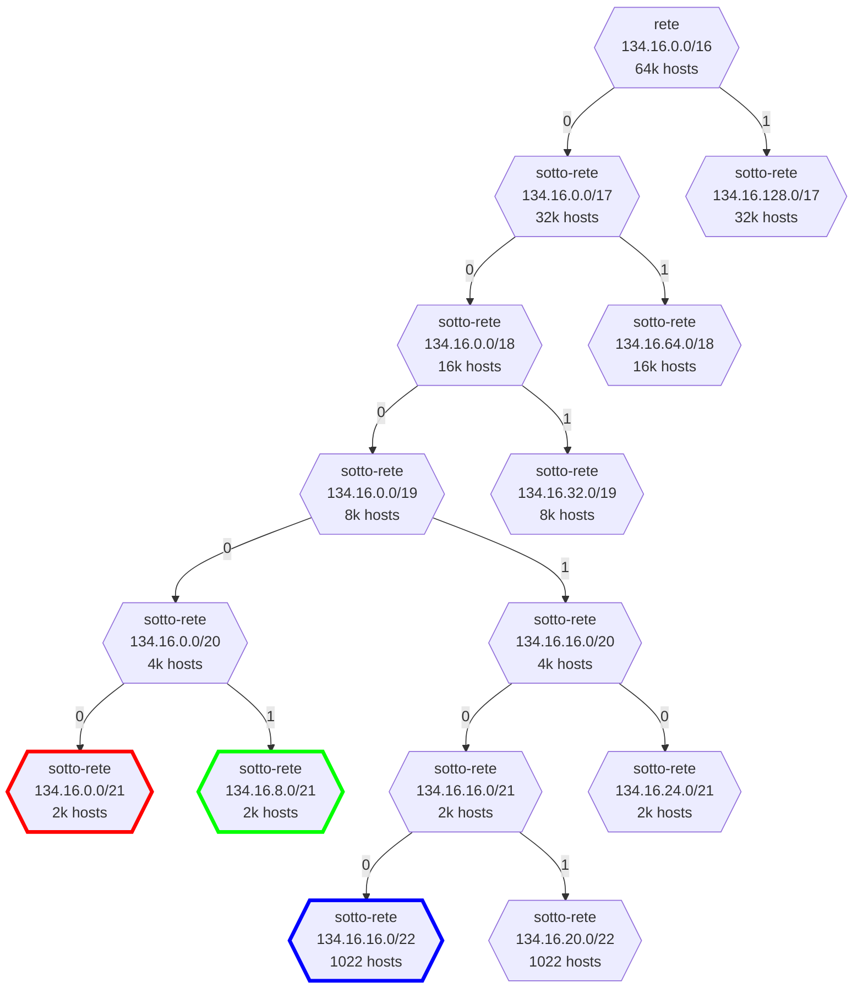
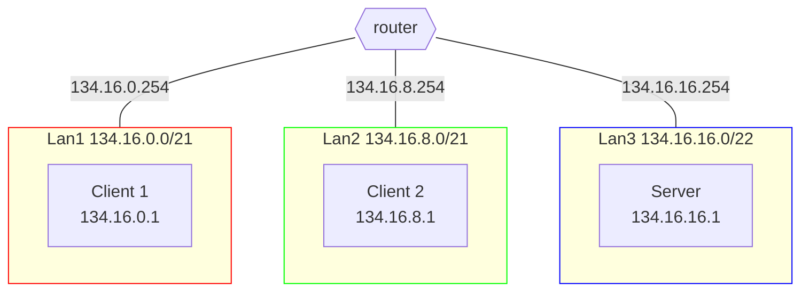

# Impiccato

## Definizione dello scenario

Gli studenti del corso di Reti di Calcolatori del DMI - UNICT hanno deciso, di loro spontanea volontà, di realizzare il gioco di forza 4 in modalità client-server.

### Progettazione della topologia

Configurare la rete secondo lo schema riportato in figura. Gli indirizzi ip da utilizzare sono nel range $134.16.0.0/16$

- Lan1 sia in grado di ospitare fino a 2000 Hosts.
  - Il **Client1** apparterrà a questa sotto-rete
- Lan2 sia in grado di ospitare fino a 1024 Hosts.
  - Il **Client2** apparterrà a questa sotto-rete
- Lan3 sia in grado di ospitare fino a 520 Hosts.
  - Il **Server** apparterrà a questa sotto-rete

Si ha completa libertà nell'assegnamento degli ip alle macchine in ogni sotto-rete, purché tale ip sia valido.



[Soluzione](#soluzione-progettazione-della-topologia)

### Realizzazione del networking

Dopo aver abbozzato la topologia su carta, si realizzi il networking definito in precedenza con delle macchine virtuali.  
Le macchine devono essere in grado di pingare tutte le altre.

[Soluzione](#soluzione-realizzazione-del-networking)

### Programmazione Socket

Due macchine client si sfideranno tra di loro a fine di vincere una partita di **Forza 4**, con una griglia 6x7.
Il server dovrà gestire la partita, controllare l'eventuale vincitore e notificare i client sullo stato della partita.
Ad ogni turno:

- Il server prima invierà al client di turno lo stato del gioco, ovvero la griglia di gioco con le pedine già posizionate.
- Ogni client ad ogni turno avrà la possibilità solo di indicare la colonna in cui posizionare la pedina (1 - 7). Se la mossa non è valida, il server dovrà notificare il client e chiedere di ripetere la mossa.
- Non appena il giocatore avrà posizionato la pedina, il server dovrà controllare se il giocatore ha vinto o meno. In caso di vittoria, il server dovrà notificare il client e terminare la partita.
- Se non è più possibile fare mosse, la partita finisce in pareggio.

Il server dovrà memorizzare in una struct client il nome del giocatore e tutte le informazioni necessarie a comunicare con il client successivamente.
Notare che, massimo possono giocare solo 2 client a partita e il gioco inizierà solo quando il server avrà registrato (struct client) i due giocatori.
I client seguono il protocollo onestamente.
Il server sceglierà il client che inizierà la partita con modalità a scelta libera dello studente (random, il primo che si è registrato, ecc...).

Progettare ed implementare **Forza 4** tramite TCP o UDP, considerando l'architettura vista prima.

#### Note e suggerimenti

- Si vince quando si allineano 4 pedine dello stesso colore in orizzontale, verticale o diagonale.
- I client dovranno attendere il proprio turno per giocare, probabilmente bloccati da una `recvfrom()`.
- Ad ogni mossa, il client indica solo la colonna dove inserire la pedina, che "cadrà" riempendo la prima casella vuota della colonna.
- Non è possibile inserire pedine in una colonna già piena.
- Ogni turno verrà inviata la griglia, che avrà l'aspetto di qualcosa come:
  ```text
  | | | | | | | |
  | | | | | | |x|
  | | | | | | |o|
  |x| |x| | | |o|
  |o| |o|x| |o|x|
  |o|x|o|x|x|x|o|
  ```



[Soluzione](#soluzione-programmazione-socket)

---

## Soluzioni

> [!Note]  
> Prima di leggere le soluzioni, provare a risolvere l'esercizio da soli.
> Dopo averlo fatto, confrontare la propria soluzione con quella proposta.
> Ci sono tantissimi modi per risolvere le varie consegne, quindi non c'è da preoccuparsi se la propria soluzione è diversa da quella proposta.

### Soluzione: Progettazione della topologia



---



### Soluzione: Realizzazione del networking

#### Client 1

```shell
# Client1
ip addr add 134.16.0.1/21
ip route add default via 134.16.0.254
```

oppure

```py
# Client1
# nano /etc/network/interfaces
# ...
auto enp0s3
iface enp0s3 inet static
    address 134.16.0.1/21
    gateway 134.16.0.254

```

#### Client2

```shell
# Client2
ip addr add 134.16.8.1/21
ip route add default via 134.16.8.254
```

oppure

```py
# Client2
# nano /etc/network/interfaces
# ...
auto enp0s3
iface enp0s3 inet static
    address 134.16.8.1/21
    gateway 134.16.8.254
```

#### Server

```shell
# Server
ip addr add 134.16.16.1/22
ip route add default via 134.16.16.254
```

oppure

```py
# Server
# nano /etc/network/interfaces
# ...
auto enp0s3
iface enp0s3 inet static
    address 134.16.16.1/22
    gateway 134.16.16.254
```

#### Router

```shell
# Router
ip link set enp0s8 up
ip link set enp0s9 up
ip addr add 134.16.0.254/21 dev enp0s3
ip addr add 134.16.8.254/21 dev enp0s8
ip addr add 134.16.16.254/22 dev enp0s9
sysctl -w net.ipv4.ip_forward=1
```

oppure

```py
# Router
# nano /etc/network/interfaces
# ...
auto enp0s3
iface enp0s3 inet static
    address 134.16.0.254/21

auto enp0s8
iface enp0s8 inet static
    address 134.16.8.254/21

auto enp0s9
iface enp0s9 inet static
    address 134.16.16.254/22
```

```py
# Router
# nano /etc/sysctl.conf
net.ipv4.ip_forward=1
```

### Soluzione: Programmazione Socket

[server.c](./server.c)  
[client.c](./client.c)
