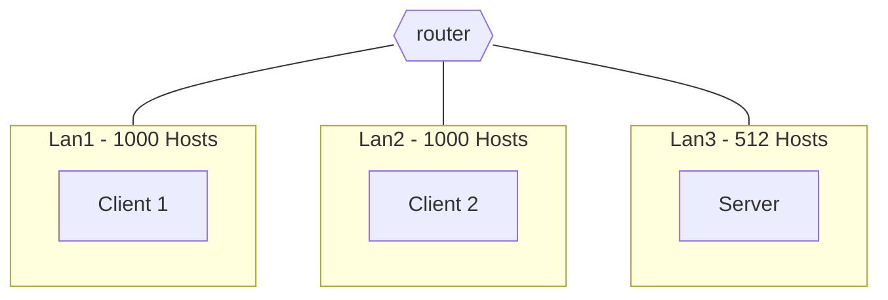
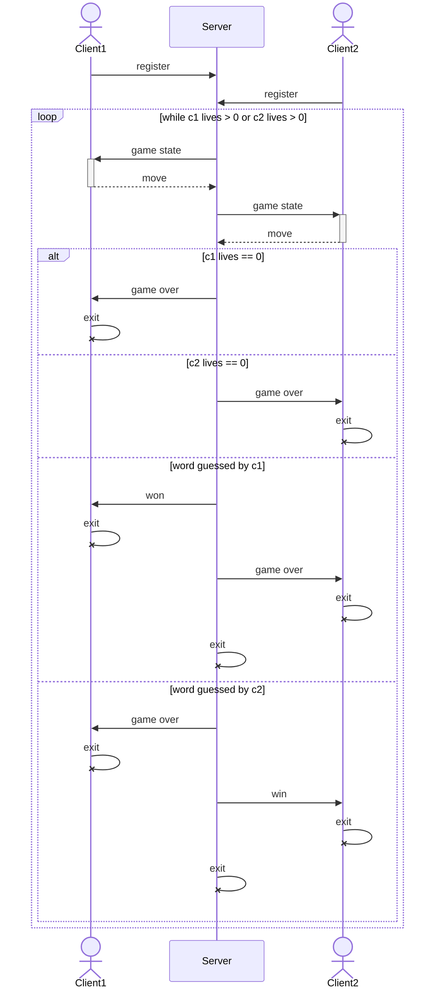
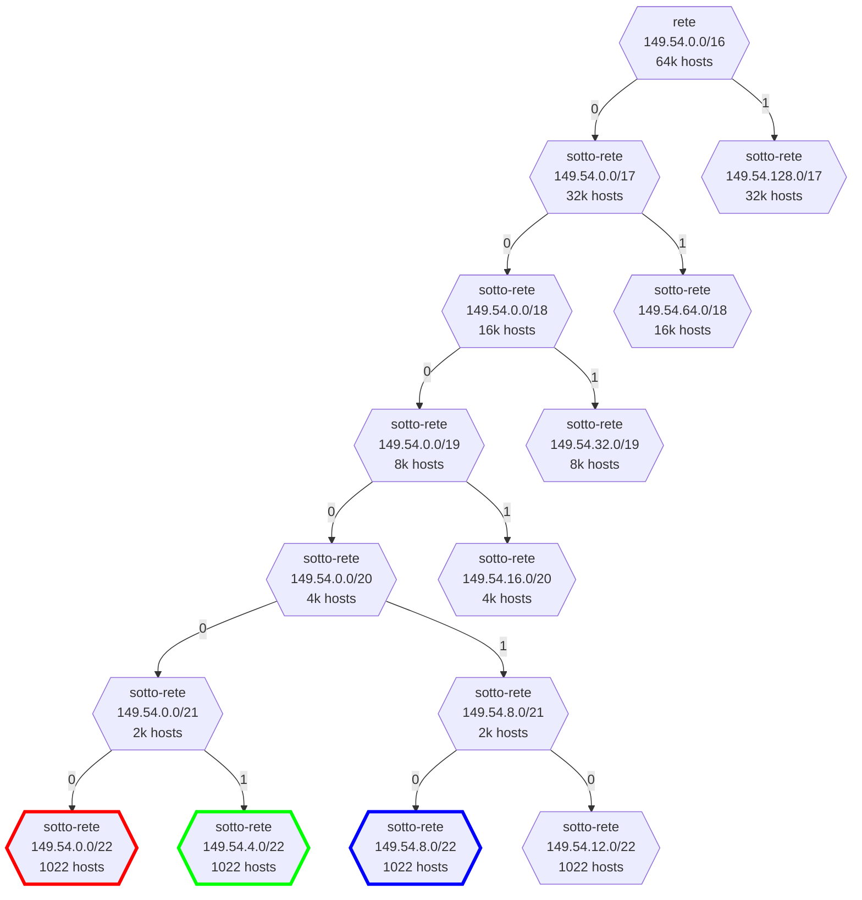
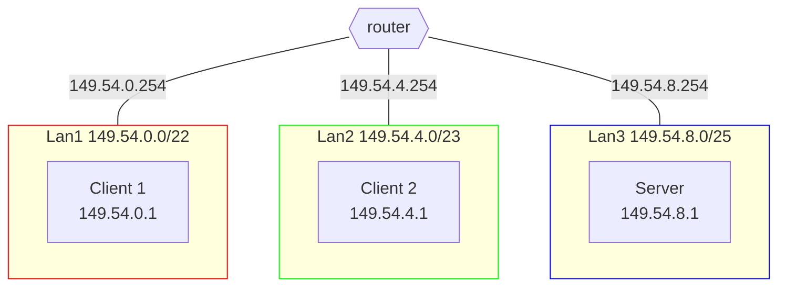

# Impiccato

## Definizione dello scenario

Gli studenti del corso di Reti di Calcolatori del DMI - UNICT hanno deciso, di loro spontanea volontà, di realizzare il gioco dell'impiccato tra macchine virtuali.

### Progettazione della topologia

Configurare la rete secondo lo schema riportato in figura. Gli indirizzi ip da utilizzare sono nel range $149.54.0.0/16$

- Lan1 sia in grado di ospitare fino a 1000 Hosts.
  - Il **Client1** apparterrà a questa sotto-rete
- Lan2 sia in grado di ospitare fino a 1000 Hosts.
  - Il **Client2** apparterrà a questa sotto-rete
- Lan3 sia in grado di ospitare fino a 512 Hosts.
  - Il **Server** apparterrà a questa sotto-rete

Si ha completa libertà nell'assegnamento degli ip alle macchine in ogni sotto-rete, purché tale ip sia valido.



[Soluzione](#soluzione-progettazione-della-topologia)

### Realizzazione del networking

Dopo aver abbozzato la topologia su carta, si realizzi il networking definito in precedenza con delle macchine virtuali.  
Le macchine devono essere in grado di pingare tutte le altre.

[Soluzione](#soluzione-realizzazione-del-networking)

### Programmazione Socket

Due macchine client si sfideranno tra di loro a fine di indovinare la parola segreta presente in una macchina server.
Ogni macchina client avrà a disposizione 3 vite. Il conteggio delle vite sarà tenuto dal server.
Ad ogni turno:

- Il server prima invierà al client di turno lo stato del gioco: lettere indovinate, lettere mancanti e struttura della parola
- Ogni client ad ogni turno avrà la possibilità solo di scrivere da riga di comando o una lettere o dare la risposta completa.
  In caso di errore, perderà una vita.
  Il server notificherà allo specifico client l'esito del turno.
- Se il giocatore di turno perde tutte le vite, dovrà terminare l'esecuzione del programma.

Il server dovrà memorizzare in una struct client il nome del giocatore, l'indirizzo IP e la porta del client.
Notare che, massimo possono giocare solo 2 client a partita e il gioco inizierà solo quando il server avrà registrato (struct client) i due giocatori.  
Il server sceglierà randomicamente una stringa da utilizzare per il gioco dell'impiccato tra quelle presenti in un array bidimensionale.  
Il server sceglierà il client che inizierà la partita con modalità a scelta libera dello studente (random, il primo che si è registrato, ecc...).

Progettare ed implementare **L'impiccato!** tramite socket UDP, considerando l'architettura vista prima.



[Soluzione](#soluzione-programmazione-socket)

---

## Soluzioni

> Prima di leggere le soluzioni, provare a risolvere l'esercizio da soli.
> Dopo averlo fatto, confrontare la propria soluzione con quella proposta.
> Ci sono tantissimi modi per risolvere le varie consegne, quindi non c'è da preoccuparsi se la propria soluzione è diversa da quella proposta.

### Soluzione: Progettazione della topologia



---



### Soluzione: Realizzazione del networking

#### Client 1

```shell
# Client1
ip addr add 149.54.0.1/22
ip route add default via 149.54.0.254
```

oppure

```py
# Client1
# nano /etc/network/interfaces
# ...
auto enp0s3
iface enp0s3 inet static
    address 149.54.0.1/22
    gateway 149.54.0.254

```

#### Client2

```shell
# Client2
ip addr add 149.54.4.1/22
ip route add default via 149.54.4.254
```

oppure

```py
# Client2
# nano /etc/network/interfaces
# ...
auto enp0s3
iface enp0s3 inet static
    address 149.54.4.1/22
    gateway 149.54.4.254
```

#### Server

```shell
# Server
ip addr add 149.54.8.1/22
ip route add default via 149.54.8.254
```

oppure

```py
# Server
# nano /etc/network/interfaces
# ...
auto enp0s3
iface enp0s3 inet static
    address 149.54.8.1/22
    gateway 149.54.8.254
```

#### Router

```shell
# Router
ip link set enp0s8 up
ip link set enp0s9 up
ip addr add 149.54.0.254/22 dev enp0s3
ip addr add 149.54.4.254/22 dev enp0s8
ip addr add 149.54.8.254/22 dev enp0s9
sysctl -w net.ipv4.ip_forward=1
```

oppure

```py
# Router
# nano /etc/network/interfaces
# ...
auto enp0s3
iface enp0s3 inet static
    address 149.54.0.254/22

auto enp0s8
iface enp0s8 inet static
    address 149.54.4.254/22

auto enp0s9
iface enp0s9 inet static
    address 149.54.8.254/22
```

```py
# Router
# nano /etc/sysctl.conf
net.ipv4.ip_forward=1
```

### Soluzione: Programmazione Socket

[server.c](./server.c)  
[client.c](./client.c)
