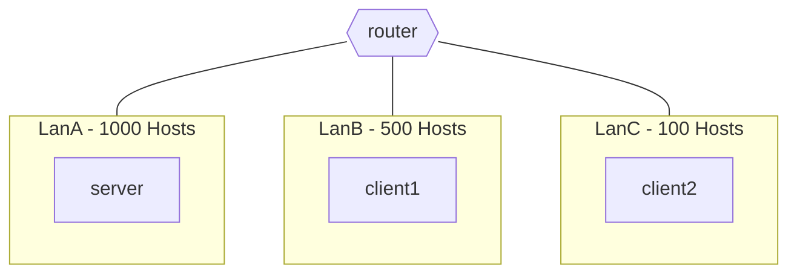
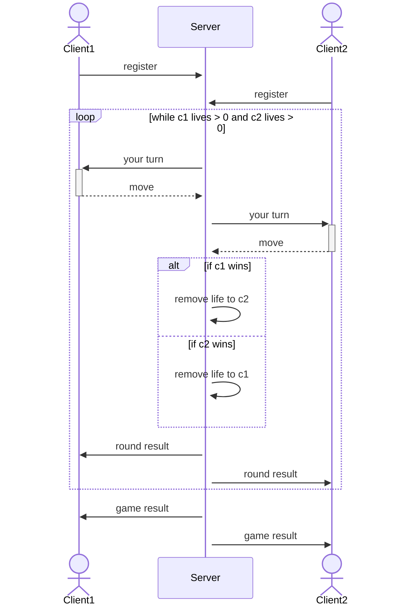
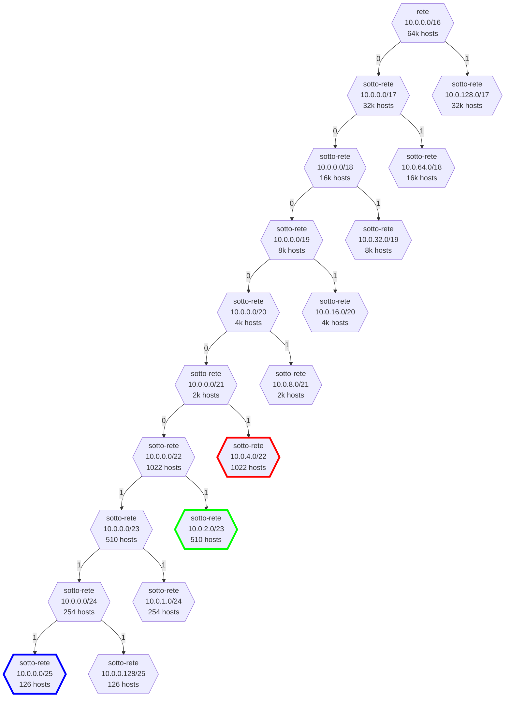
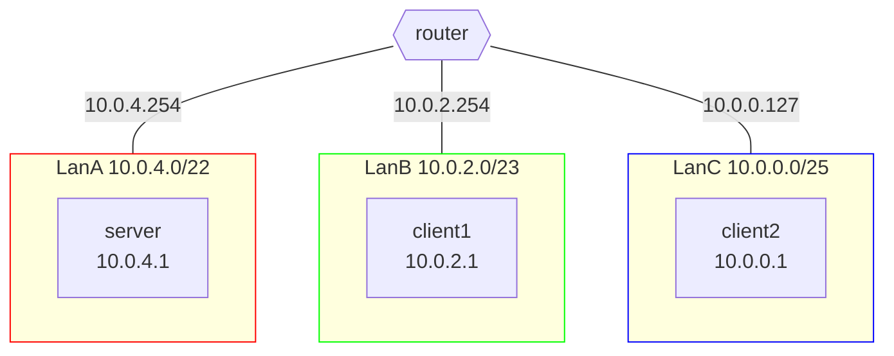

# Esercizio Rock Paper Scissors

## Definizione dello scenario

Siano date tre macchine: **Server**, **Client1** e **Client2**.  
Ciascuna delle macchine appartiene ad una sotto-rete separata.
Le comunicazione fra di loro avviene per mezzo di un **Router**, connesso a tutte e tre le LAN.

### Progettazione della topologia

Dato un range di indirizzi identificato da $10.0.0.0/16$, assegnare gli indirizzi alle sotto-reti LanA, LanB, LanC in maniera tale che

- LanA sia in grado di ospitare fino a 1000 Hosts.
  - Il **Server** apparterrà a questa sotto-rete
- LanB sia in grado di ospitare fino a 500 Hosts.
  - Il **Client1** apparterrà a questa sotto-rete
- LanC sia in grado di ospitare fino a 100 Hosts.
  - Il **Client2** apparterrà a questa sotto-rete

Si ha completa libertà nell'assegnamento degli ip alle macchine in ogni sotto-rete, purché tale ip sia valido.



[Soluzione](#soluzione-progettazione-della-topologia)

### Realizzazione del networking

Dopo aver abbozzato la topologia su carta, si realizzi il networking definito in precedenza con delle macchine virtuali.  
Le macchine devono essere in grado di pingare tutte le altre.

[Soluzione](#soluzione-realizzazione-del-networking)

### Programmazione Socket

Realizzare un programma scritto in c (o c++) che simuli una partita a "Carta-Sasso-Forbice" fra i due **Client**, con il **Server** in mezzo a fare da arbitro.
Si assuma che il numero di giocatori sia esattamente 2 e che tutti rispettino il protocollo descritto.  
Appena avviato, ogni **Client** si connette al **Server** per registrarsi, fornendo anche le informazioni che il **Server** userà per comunicare durante la partita (ip, porta).  
Quando entrambi i **Client** si sono registrati, il **Server** avvia la partita, impostando il numero di vite di entrambi i giocatori ad un valore stabilito.
Inizia quindi ad interpellare a turno i due giocatori, chiedendo la loro mossa.
Quando entrambi hanno giocato, il **Server** comunica il risultato della partita a entrambi i giocatori.
Se non si è verificato un pareggio, toglie una vita a quello che ha perso e ricomincia il ciclo.  
Quando un giocatore rimane senza vite, il **Server** comunica il vincitore ad entrambi e termina la partita.



[Soluzione](#soluzione-programmazione-socket)

---

## Soluzioni

> Prima di leggere le soluzioni, provare a risolvere l'esercizio da soli.
> Dopo averlo fatto, confrontare la propria soluzione con quella proposta.
> Ci sono tantissimi modi per risolvere le varie consegne, quindi non c'è da preoccuparsi se la propria soluzione è diversa da quella proposta.

### Soluzione: Progettazione della topologia



---



### Soluzione: Realizzazione del networking

#### Server

```shell
# Server
ip addr add 10.0.4.1/22
ip route add default via 10.0.4.254
```

oppure

```py
# Server
# nano /etc/network/interfaces
# ...
auto enp0s3
iface enp0s3 inet static
    address 10.0.4.1/22
    gateway 10.0.4.254
```

#### Client 1

```shell
# Client1
ip addr add 10.0.2.1/23
ip route add default via 10.0.2.254
```

oppure

```py
# Client1
# nano /etc/network/interfaces
# ...
auto enp0s3
iface enp0s3 inet static
    address 10.0.2.1/23
    gateway 10.0.2.254

```

#### Client2

```shell
# Client2
ip addr add 10.0.0.1/25
ip route add default via 10.0.0.127
```

oppure

```py
# Client2
# nano /etc/network/interfaces
# ...
auto enp0s3
iface enp0s3 inet static
    address 10.0.0.1/25
    gateway 10.0.0.127
```

#### Router

```shell
# Router
ip link set enp0s8 up
ip link set enp0s9 up
ip addr add 10.0.4.254/22 dev enp0s3
ip addr add 10.0.2.254/23 dev enp0s8
ip addr add 10.0.0.127/25 dev enp0s9
sysctl -w net.ipv4.ip_forward=1
```

oppure

```py
# Router
# nano /etc/network/interfaces
# ...
auto enp0s3
iface enp0s3 inet static
    address 10.0.4.254/22

auto enp0s8
iface enp0s8 inet static
    address 10.0.2.254/23

auto enp0s9
iface enp0s9 inet static
    address 10.0.0.127/25
```

```py
# Router
# nano /etc/sysctl.conf
net.ipv4.ip_forward=1
```

### Soluzione: Programmazione Socket

[server.c](./server.c)  
[client.c](./client.c)
