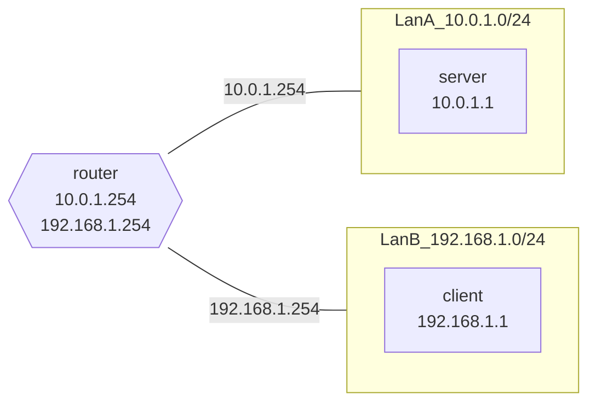

# Esercizio di server-router-client

Realizzare il seguente schema di routing basilare:

```mermaid
flowchart LR


r{{"`router<br>10.0.1.254<br>192.168.1.254`"}}

subgraph LanA_10.0.1.0/24
    s["`server<br>10.0.1.1`"]
end


subgraph LanB_192.168.1.0/24
    c["`client<br>192.168.1.1`"]
end

    r --10.0.1.254--- LanA_10.0.1.0/24
    r --192.168.1.254--- LanB_192.168.1.0/24
```
