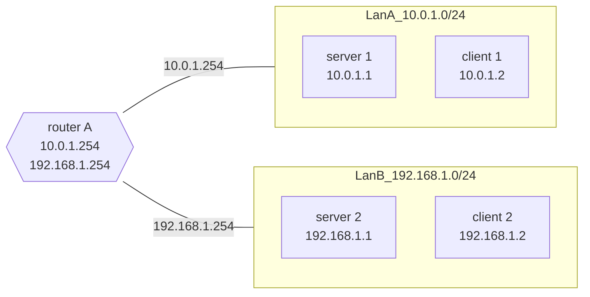
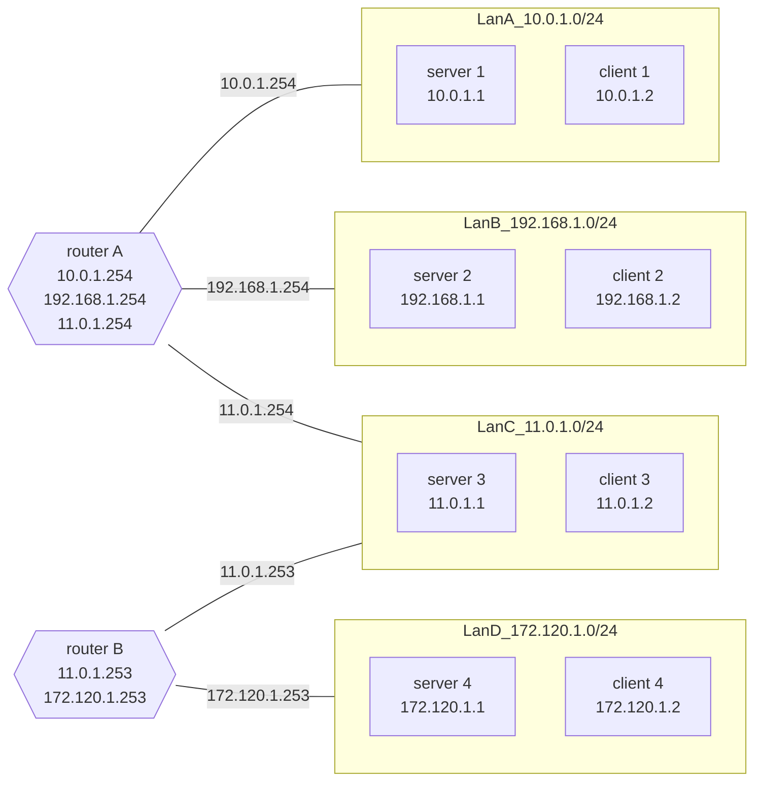

# Esercizio di server-routing

## Prima task

Realizzare il seguente schema di routing:

```mermaid
flowchart LR


r{{"`router A<br>10.0.1.254<br>192.168.1.254`"}}

subgraph LanA_10.0.1.0/24
    s1["`server 1<br>10.0.1.1`"]
    c1["`client 1<br>10.0.1.2`"]
end


subgraph LanB_192.168.1.0/24
    s2["`server 2<br>192.168.1.1`"]
    c2["`client 2<br>192.168.1.2`"]
end

    r --10.0.1.254--- LanA_10.0.1.0/24
    r --192.168.1.254--- LanB_192.168.1.0/24
```

## Seconda task

Estendere il primo esercizio con il seguente schema di routing:

```mermaid
flowchart LR


r{{"`router A<br>10.0.1.254<br>192.168.1.254<br>11.0.1.254`"}}
rb{{"`router B<br>11.0.1.253<br>172.120.1.253`"}}

subgraph LanA_10.0.1.0/24
    s1["`server 1<br>10.0.1.1`"]
    c1["`client 1<br>10.0.1.2`"]
end


subgraph LanB_192.168.1.0/24
    s2["`server 2<br>192.168.1.1`"]
    c2["`client 2<br>192.168.1.2`"]
end

subgraph LanC_11.0.1.0/24
    s3["`server 3<br>11.0.1.1`"]
    c3["`client 3<br>11.0.1.2`"]
end

subgraph LanD_172.120.1.0/24
    s4["`server 4<br>172.120.1.1`"]
    c4["`client 4<br>172.120.1.2`"]
end

    r --10.0.1.254--- LanA_10.0.1.0/24
    r --192.168.1.254--- LanB_192.168.1.0/24
    r --11.0.1.254--- LanC_11.0.1.0/24
    rb --172.120.1.253--- LanD_172.120.1.0/24
    rb --11.0.1.253--- LanC_11.0.1.0/24
```
