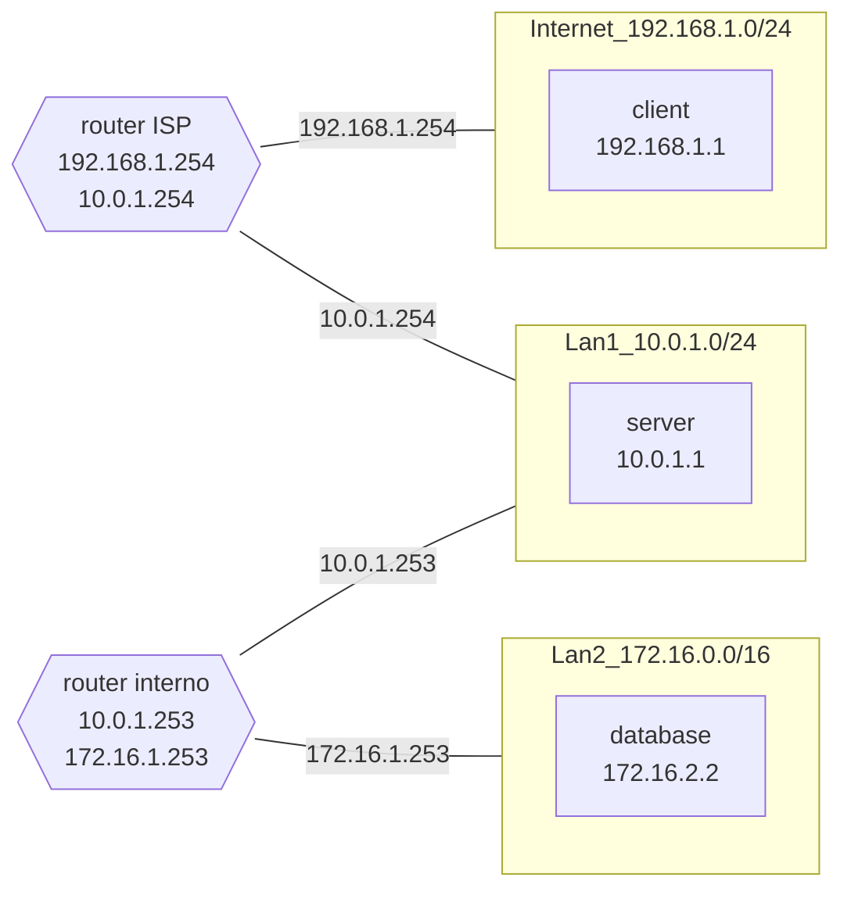

# Topologia di un Web Server a 2 livelli

## Descrizione

In questa topologia, ci si immagina un web server che riceve richieste dai client.
Poiché i client si trovano in una sottorete differente, tali messaggi verranno veicolati da un router dell' ISP (Internet Service Provider).  
Il server consulterà poi il database per ottenere le informazioni relative alla pagina web da servire al client.

Per motivi di sicurezza, il database si trova in una sottorete differente rispetto al server, e la comunicazione avviene tramite un router interno.
Il router dell'ISP non conosce il router interno, in maniera da rendere il database inaccessibile dall'esterno.  
Il server deve quindi essere in grado di decidere dove inviare i pacchetti, verso l'esterno o l'interno, in base all'indirizzo IP di destinazione.

## Topologia

