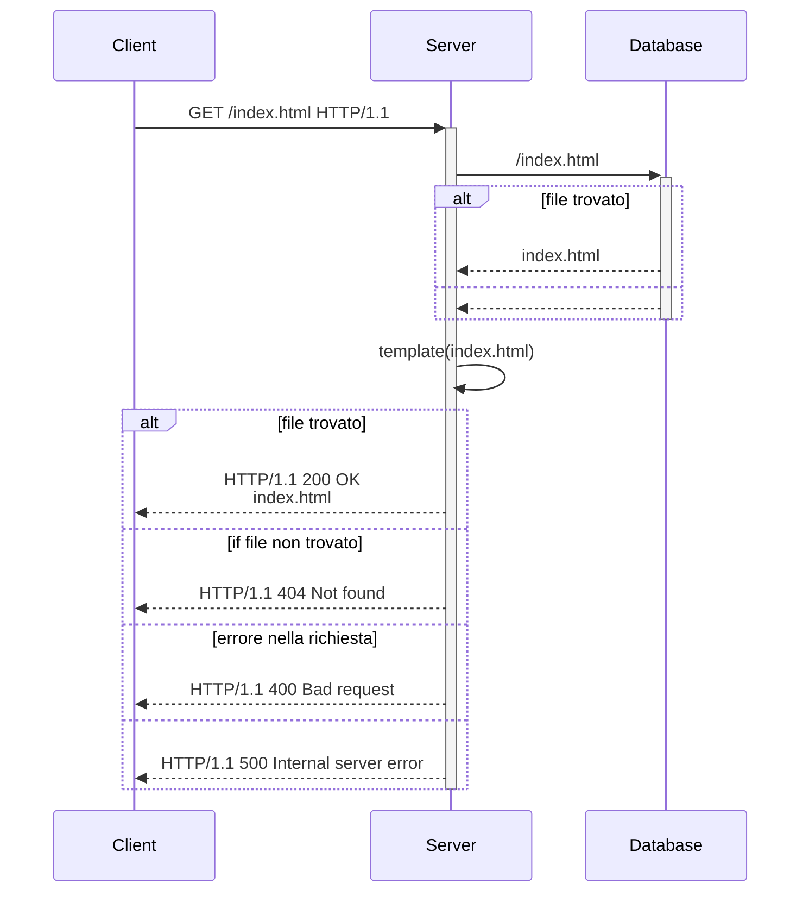

# Web server

## Descrizione

Realizzare un web server a due livelli che implementi il protocollo _HTTP_ per il trasferimento di file _.html_.

I client si collegheranno al server e comunicheranno con esso utilizzando il protocollo _HTTP_.
Il server supporterà solo il metodo _GET_.

Una volta ricevuta una richiesta valida, il server procederà ad rigirarla al database.
Questo cercherà di soddisfarla trasferendo il file _.html_ indicato, se presente.
Se tale file non viene individuato, verrà inviata una stringa vuota.

Una volta ottenuto il file, seguendo il paradigma del server side rendering, il server provvederà ad effettuare delle operazioni di templating per sostituire eventuali placeholder presenti nel file _.html_ con il loro valore corretto.

| Placeholder | Risultato                                     |
| ----------- | --------------------------------------------- |
| {{date}}    | Data corrente in formato DD/BBB/YYYY HH:mm:ss |
| {{ip}}      | Ip del client nel formato x.x.x.x             |

Il server provvederà infine ad inviare il file _.html_, correttamente editato, al client.
Nel caso si verificassero dei problemi, o il file richiesto non dovesse esistere, andrà restituito uno status code _HTTP_ indicativo.

### Diagramma di sequenza

