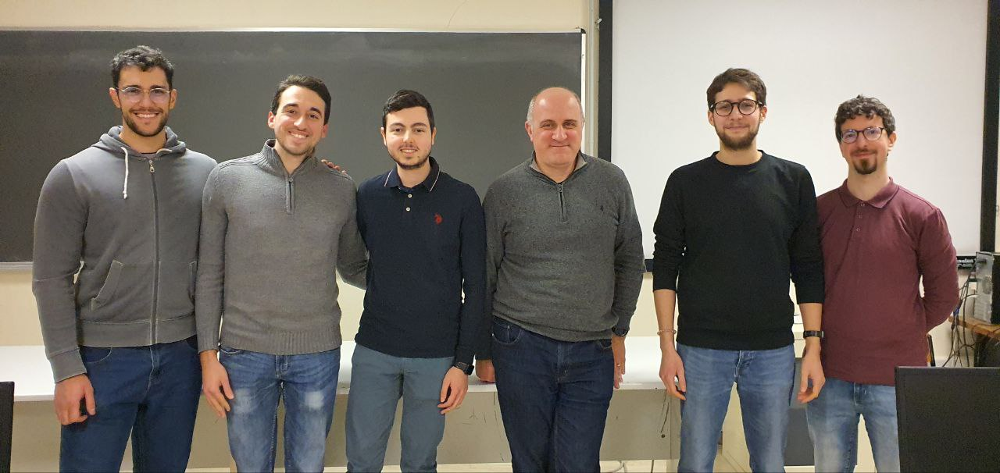

# Introduzione

Tutorato del corso di [Reti di Calcolatori](http://web.dmi.unict.it/corsi/l-31/insegnamenti?seuid=EF0D54F4-9429-4853-A10C-355A2FD9C3A1) 2022/2023.

<!-- New section -->

## Chi sono

- Ernesto Casablanca
- TendTo
- Studente di informatica
- Secondo anno di magistrale

<!-- New subsection -->

### Contatti

- [Email](mailto:casablancaernesto@gmail.com)
- [Telegram](https://t.me/TendTo)
- [Github](https://github.com/TendTo)

<!-- New section -->

## Contatti tutorato

- [Tutorato Reti di Calcolatori (DMI)](https://t.me/+atIlrFYsi3I5NDc8)

</img>

<!-- New section -->

## Materiale

Tutto il materiale, lezione per lezione, sarà disponibile su [Github](https://github.com/TendTo/Tutorato-Reti-di-Calcolatori).

Le slide, in particolare, saranno consultabili [online](https://tendto.github.io/Tutorato-Reti-di-Calcolatori), sotto forma di slideshow.

<!-- .element: class="fragment" -->

Se avete suggerimenti o correzioni da fare, aprite una [issue](https://github.com/TendTo/Tutorato-Reti-di-Calcolatori/issues).

<!-- .element: class="fragment" -->

<!-- New section -->

## Organizzazione del corso

Sarà data priorità alle vostre richieste.

Ci si concentrerà particolarmente sulla parte di laboratorio.

<!-- .element: class="fragment" data-fragment-index="1" -->

<!-- New subsection -->

### Possibili argomenti da trattare

- Virtualizzazione
- Configurazione di reti
- Programmazione socket
