# VirtualBox

Utilizzo del software di virtualizzazione VirtualBox.

<!-- New section -->

## Cosa sono le macchine virtuali?

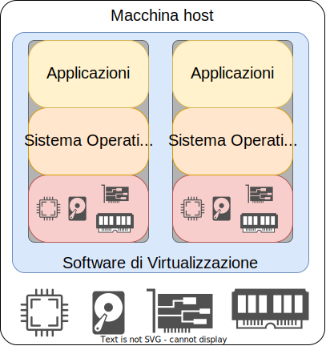

Le macchine virtuali sono software che permettono di emulare un intero computer.

<!-- New subsection -->

### Benefici della virtualizzazione

- Eseguire più sistemi diversi contemporaneamente
- Semplificare l'installazione ed utilizzo di software specifici
- Disponibilità e disaster recovery
- Debuggare e testare configurazioni di rete o architetture distribuite
- Cloud

<!-- New section -->

## Cos'è VirtualBox?

</img>

VirtualBox è un software di virtualizzazione, ovvero un programma che permette di creare e gestire macchine virtuali.

<!-- New subsection -->

### Terminologia

- **Host Operating System (host OS)**: sistema operativo che esegue VirtualBox
- **Guest Operating System (guest OS)**: sistema operativo che gira all'interno della macchina virtuale
- **Macchina virtuale (VM)**: ambiente creato da VirtualBox che emula un computer e le sue componenti
- **Guest Additions**: software opzionale che aggiunge diverse funzionalità alle VM create con VirtualBox

<!-- New subsection -->

### Immagini

I sistemi operativi vengono spesso distribuito in formato **iso**, ovvero un file immagine che contiene i file necessari per la sua istallazione.

Alternativamente, dopo aver creato una prima VM, questa può essere clonata per creare altre VM identiche con lo stesso stato.

<!-- .element: class="fragment" -->

<!-- New section -->

## Creare una macchina virtuale

Vediamo i passi necessari per creare una macchina virtuale.

<!-- New subsection -->

### Immagine del sistema operativo

Scarichiamo l'immagine del sistema operativo che vogliamo installare.

In questo caso, utilizzeremo [debian](https://cdimage.debian.org/debian-cd/current/amd64/iso-cd/).

<!-- .element: class="fragment" -->

La guida riguardo la configurazione di VirtualBox può essere consultata sul [sito](https://www.virtualbox.org/manual/UserManual.html#create-vm-wizard).

<!-- .element: class="fragment" -->

Nel momento in cui viene avviata, selezionando l'installazione grafica sarà sufficiente seguire le istruzioni a schermo.

<!-- .element: class="fragment" -->

<!-- New section -->

## Connessione ssh

Per utilizzare più agevolmente la VM, può essere comodo connettersi ad essa tramite ssh.

Questo può essere fatto dopo aver attivato il server ssh sul guest OS.  
Se l'installazione è stata quella guidata, dovrebbe essere già attivo.
Altrimenti è necessario seguire [questi passi](https://wiki.debian.org/it/SSH#Installazione_del_server).

<!-- .element: class="fragment" -->

<!-- New subsection -->

### Port forwarding

Di default, VirtualBox crea una connessione di tipo NAT.

Per poterci connettere alla VM, dobbiamo effettuare un port forwarding.

<!-- .element: class="fragment" data-fragment-index="1" -->

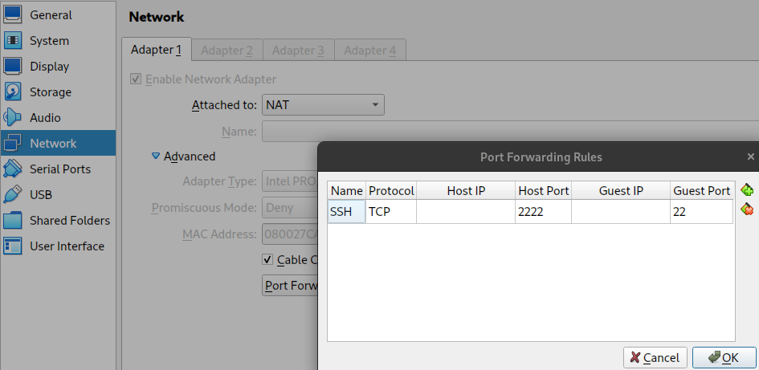</img>

<!-- .element: class="fragment" data-fragment-index="1" -->

<!-- New subsection -->

### Connessione ssh con NAT

Dall'host OS, possiamo connetterci alla VM tramite ssh.

```shell
ssh -p 2222 debian@localhost
```

<!-- New section -->

## Tipi di rete

VirtualBox supporta diversi tipi di rete.  
La scelta influenza la raggiungibilità delle VM e la loro connessione ad altre reti.

[Ulteriori dettagli](https://www.nakivo.com/blog/virtualbox-network-setting-guide/)  
[Ulteriori dettagli](https://www.virtualbox.org/manual/ch06.html)

<!-- New subsection -->

### Confronto

|    Mode     | VM → Host | VM ← Host  | VM1 ↔ VM2 | VM → LAN |  VM ← LAN  |
| :---------: | :-------: | :--------: | :-------: | :------: | :--------: |
|   Bridged   |     ✓     |     ✓      |     ✓     |    ✓     |     ✓      |
| NAT network |     ✓     | Forwarding |     ✓     |    ✓     | Forwarding |
|     NAT     |     ✓     | Forwarding |           |    ✓     | Forwarding |
|  Host-only  |     ✓     |     ✓      |     ✓     |          |            |
|  Internal   |           |            |     ✓     |          |            |
|  Detached   |           |            |           |          |            |

<!-- New subsection -->

### NAT

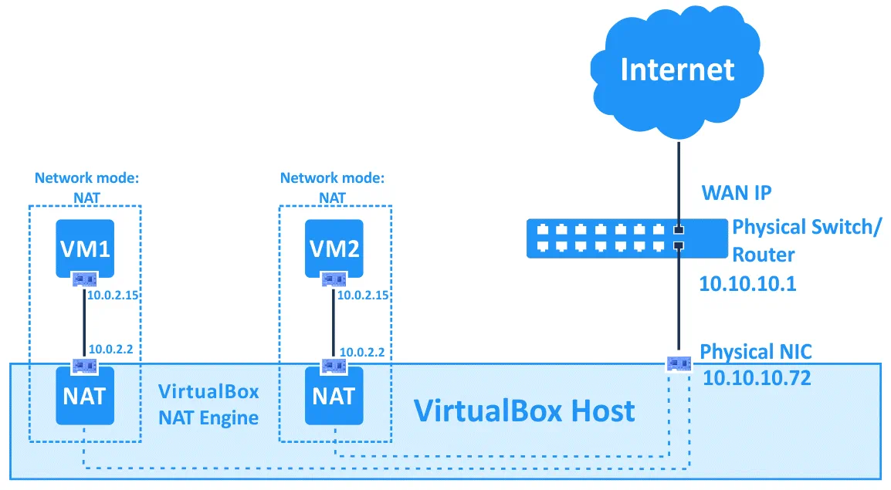</img>

<!-- New subsection -->

### NAT network

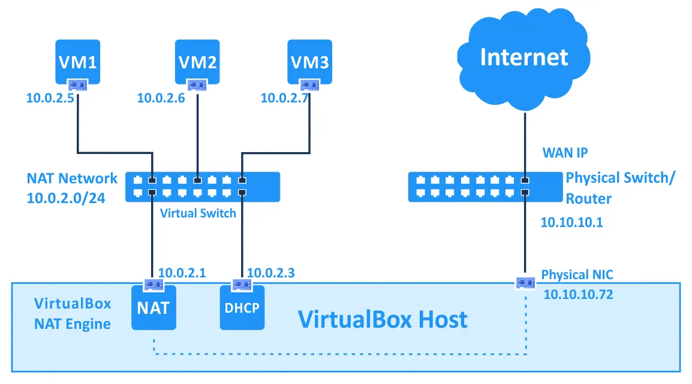</img>

<!-- New subsection -->

### Bridged

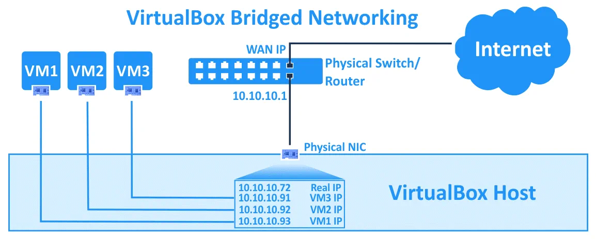</img>

<!-- New subsection -->

### Internal network

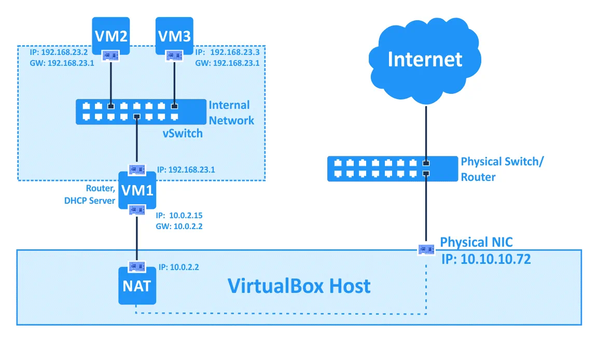</img>

<!-- New subsection -->

### Host only

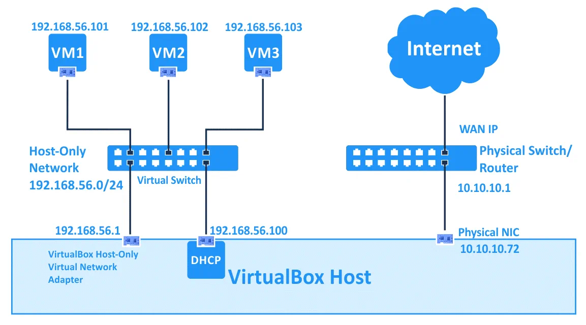</img>

<!-- New section -->

## Passaggi chiave

Di seguito ci sarà una serie di passaggi o di controlli da fare per verificare la correttezza della configurazione di VirtualBox.

Assicuratevi che il passaggio sia fatto sulla macchina corretta guardando il prompt della shell: host (il vostro computer) o vm (la macchina virtuale).

<!-- .element: class="fragment" -->

Alcune operazioni richiedono privilegi di amministratore.
Se è questo il caso, il prompt della shell mostrerà l'utente _root_
Per eseguire tali operazioni, potete aggiungere `sudo` prima del comando o cambiare utente con `su`, diventando _root_.

<!-- .element: class="fragment" -->

<!-- New subsection -->

### Rete host-only

Dopo aver effettuato tutti gli eventuali aggiornamenti ed installazioni che necessitano internet, generalmente si userà la rete **host-only**.

Bisogna assicurarsi che Virtualbox abbia creato tale rete.

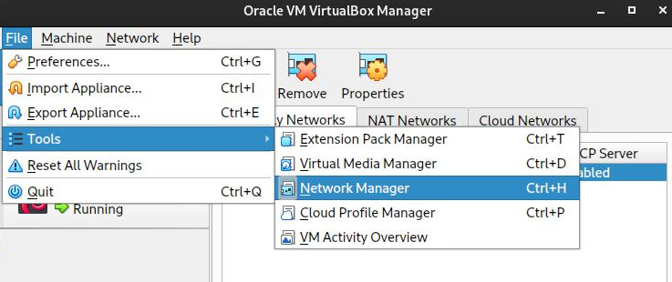

<!-- New subsection -->

### Interfaccia di rete host-only

A quel punto si deve impostare l'interfaccia di rete che userà la VM.

Se clonate una macchina, assicuratevi di cambiare il MAC address.

<!-- .element: class="fragment" -->

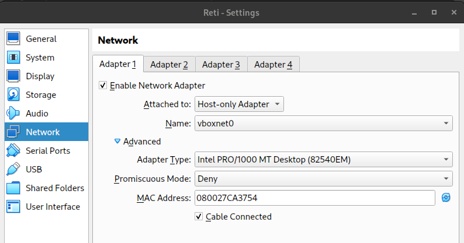

<!-- .element: class="fragment" -->

<!-- New subsection -->

### Conoscere l'indirizzo ip della VM

Per poter connettere la VM, è necessario conoscere il suo indirizzo ip.
Questo può essere fatto con il comando `ip a`.

```shell
user@vm:~$ ip a
1: lo: <LOOPBACK,UP,LOWER_UP> mtu 65536 qdisc noqueue ...
    ...
2: enp0s3: <BROADCAST,MULTICAST,UP,LOWER_UP> mtu 1500 ...
    link/ether 0a:00:27:00:00:00 brd ff:ff:ff:ff:ff:ff
    inet 192.168.56.24/24 brd 192.168.56.255 scope global enp0s3
       valid_lft forever preferred_lft forever
    inet6 fe80::800:27ff:fe00:3754/64 scope link
       valid_lft forever preferred_lft forever
```

L'interfaccia è la `enp0s3`, e gli indirizzi sono `192.168.56.24` per IpV4 e `fe80::800:27ff:fe00:2754` per IpV6.

<!-- .element: class="fragment" -->

<!-- New subsection -->

#### Check della connessione

A questo punto la VM dovrebbe essere raggiungibile dall'host.
La connessione può essere verificata con il comando `ping`.

```shell
# ping <ip VM>
user@host:~$ ping 192.168.56.24
```

<!-- New subsection -->

### SSH

SSH è un tool, nonché un protocollo, per poter accedere alla VM da remoto.
La VM deve fornire un server SSH a cui l'host si connetterà.

Per verificare che il server SSH sia attivo, si può usare il comando `systemctl`.
Potrebbe essere necessario essere root.

<!-- .element: class="fragment" data-fragment-index="1" -->

```shell
root@vm:~$ systemctl status ssh
ssh.service - OpenBSD Secure Shell server
    Loaded: loaded (/lib/systemd/system/ssh.service; enabled)
    Active: active (running) since Fri 2021-09-24 15:27:55 CEST; 1h 26min ago
    ...
```

<!-- .element: class="fragment" data-fragment-index="1" -->

<!-- New subsection -->

#### Installazione server SSH

Se il server SSH non è installato, può essere fatto con il comando `apt`.
Bisogna assicurarsi di avere i privilegi di root.  
Inoltre sarà necessario accedere ad internet per effettuare il download.
Quindi la VM dovrà essere connessa utilizzando la rete NAT.

```shell
root@vm:~$ apt update # Aggiornamento dei pacchetti, se non ancora fatto
root@vm:~$ apt install openssh-server
```

<!-- New subsection -->

#### Check della connessione ssh

A questo punto la VM dovrebbe essere raggiungibile dall'host tramite ssh.
La connessione può essere verificata con il comando `ssh`.

```shell
# ssh <user>@<ip VM>
user@host:~$ ssh user@192.168.56.24
```

La prima volta che effettuate la connessione vi verrà chiesto di accettare la chiave pubblica (fingerprint) del server ssh.
Per proseguire basta digitare `yes`.

<!-- .element: class="fragment" -->

<!-- New subsection -->

### Connessione con VsCode remote ssh

VsCode offre l'estensione [Remote - SSH](https://marketplace.visualstudio.com/items?itemName=ms-vscode-remote.remote-ssh) che fornisce una connessione ssh agevolata.

Nel connettervi alla VM, non utilizzate l'account di root, ma quello utente, con la sua password.

<!-- .element: class="fragment" -->

Al primo avvio sarà necessario attendere per l'installazione del server VsCode sulla VM.

<!-- .element: class="fragment" -->

[Ulteriori dettagli](https://code.visualstudio.com/docs/remote/ssh-tutorial)

<!-- .element: class="fragment" -->

<!-- New section -->

## Tips and tricks

Serie di consigli e trucchi per utilizzare al meglio le macchine virtuali e VsCode.

<!-- New subsection -->

### Permessi di amministratore

Quando si effettua il login tramite ssh, si dovrebbe utilizzare sempre un utente non privilegiato.
Se vi dovesse servire agire con i permessi di amministratore, potete:

- premettere il comando con `sudo` (es. `sudo apt update`). Verrà chiesta la password dell'utente.
- cambiare utente da terminale usando il comando `su`. Verrà chiesta la password di root.

```shell
# Da user a root
user@vm:~$ su
Password:
# Da root a user
root@vm:/home/user$ su user
user@vm:~$
```

<!-- New subsection -->

### Aggiungere un host alla config di ssh

Invece di inserire ogni volta la stringa `user@ip` per connettersi alla VM, è possibile aggiungere un host alla configurazione di ssh.

Questa operazione può essere fatta sia dal menù di connessione di VsCode, selezionando  
`+ Add New SSH Host...`  
sia manualmente, editando il file `~/.ssh/config`.

<!-- .element: class="fragment" data-fragment-index="1" -->

```shell
# ~/.ssh/config
Host vm                     # Nome mostrato nella lista di VsCode
    HostName 192.168.56.24  # Ip della VM
    User user               # Utente con cui connettersi
```

<!-- .element: class="fragment" data-fragment-index="1" -->

<!-- New subsection -->

### Risparmiare tempo con i cloni

Se avete bisogno di creare più VM identiche, potete effettuare delle clonazioni, così da evitare di ripetere il setup più volte.

In questo caso, connettendosi con VsCode alla VM originale, effettuerete il setup del server VsCode e potreste anche installare eventuali estensioni, in particolare quella di [C/C++](https://marketplace.visualstudio.com/items?itemName=ms-vscode.cpptools).
Tutte le macchine clone si ritroveranno tutto il necessario già pronto.

<!-- .element: class="fragment" -->

Ricordatevi di cambiare il MAC address delle VM clonate.

<!-- .element: class="fragment" -->

<!-- New subsection -->

### Eseguire più comandi contemporaneamente

Quando si lancia un comando da terminale, il terminale rimane occupato fino a che il comando non termina.

Questo può essere scomodo se si vuole eseguire più comandi che rimangono in esecuzione contemporaneamente, come ad esempio un server e un client.

<!-- .element: class="fragment" -->

<!-- New subsection -->

#### Più terminali

Il modo più semplice per eseguire più comandi contemporaneamente è quello di aprire più terminali:

- **VsCode**: `Terminal` -> `New Terminal` (o `Split terminal`)
- **ssh**: Lanciare una nuova connessione ssh in un nuovo terminale

<!-- New subsection -->

#### Comandi in background

Un comando può essere eseguito in background aggiungendo `&` alla fine del comando.  
I programmi in background non ricevono input da tastiera e non mostrano output sul terminale.

```shell
user@vm:~$ ./server 2000 & ./client 127.0.0.1 2000
```

Per vedere i comandi in background, si può usare il comando `jobs`.

<!-- .element: class="fragment" data-fragment-index="1" -->

```shell
user@vm:~$ jobs
[1]+  Running                 ./server &
```

<!-- .element: class="fragment" data-fragment-index="1" -->

Per riportare un comando in background in foreground, si può usare il comando `fg`, potendolo poi interrompere con `Ctrl+C`.

<!-- .element: class="fragment" data-fragment-index="2" -->

```shell
user@vm:~$ fg %1
```

<!-- .element: class="fragment" data-fragment-index="2" -->

<!-- New subsection -->

#### Terminal multiplexer

Un terminal multiplexer è un software che permette di dividere una finestra di terminale in più parti, o pannelli indipendenti.

Alcuni esempi sono:

<!-- .element: class="fragment" data-fragment-index="1" -->

- [tmux](httèps://github.com/tmux/tmux)
- [screen](https://www.gnu.org/software/screen/)
- [byobu](https://byobu.org/)

<!-- .element: class="fragment" data-fragment-index="1" -->

<!-- New subsection -->

##### byobu

Byobu è un frontend per tmux o screen, che permette di avere una serie di comandi predefiniti per la gestione delle sessioni.

Per installarlo, basta usare il comando `apt`.

```shell
root@vm:~$ apt install byobu
```

Per avviarlo, basta digitare `byobu` da terminale.

<!-- .element: class="fragment" -->

<!-- New subsection -->

##### byobu keybindings

Byobu offre una serie di keybindings per la gestione delle sessioni.
Ecco i più comuni:

- `F2`: crea una nuova finestra
- `F3` e `F4`: naviga tra le finestre
- `shift + F2`: divide la finestra orizzontalmente
- `shift + F3 / F4`: naviga tra i pannelli orizzontali
- comando `exit`: chiude la finestra corrente

<!-- New section -->

## Comandi shell utili

Lista di comandi utili da terminale suddivisi per macro categorie.

<!-- New subsection -->

### Comandi di rete e ssh

- `ip a`: mostra le interfacce di rete e i relativi indirizzi ip
- `ip r`: mostra la tabella di routing
- `ping <ip>`: invia un pacchetto icmp echo request all'ip specificato
- `ssh <user>@<ip>`: connessione ssh all'ip specificato
- `scp <file locale> <user>@<ip>:<dest remota>`: copia il file locale in remoto
- `scp <user>@<ip>:<file remoto> <dest locale>`: copia il file remoto in locale

<!-- New subsection -->

### Comandi di sistema

- `ls`: mostra i file e le cartelle presenti nella cartella corrente
- `ls -la`: lista estesa
- `mkdir <cartella>`: crea una nuova cartella
- `cd <cartella>`: entra nella cartella
- `rm <file>`: rimuove il file
- `rm -r <cartella>`: rimuove la cartella e tutto il suo contenuto
- `mv <file> <destinazione>`: rinomina il file o lo sposta
- `cp <file> <destinazione>`: copia il file
- `cat <file>`: mostra il contenuto del file
- `nano <file>`: apre il file con l'editor nano

<!-- New subsection -->

### Comandi di servizio

- `systemctl status <nome servizio>`: mostra lo stato del servizio
- `systemctl start <nome servizio>`: avvia il servizio
- `systemctl stop <nome servizio>`: ferma il servizio
- `systemctl restart <nome servizio>`: riavvia il servizio
- `systemctl enable <nome servizio>`: avvia il servizio all'avvio della macchina

<!-- New section -->

## Sniffing di rete

Capire meglio come funziona la rete e tutti i protocolli che vengono utilizzati diventa più facile quando si ha modo di osservare il traffico di rete.

Vi sono vari tool in grado di ottenere questo risultato.
Noi vedremo una combinazione fra le funzionalità di VirtualBox e [Wireshark](https://www.wireshark.org/) per visualizzare i file [_.pcap_](https://en.wikipedia.org/wiki/Pcap).

<!-- .element: class="fragment" -->

<!-- New subsection -->

### Abilitare la cattura del traffico

VirtualBox prevede l'opzione di catturare tutto il traffico che coinvolge una macchina virtuale, salvandolo in un file _.pcap_.  
Il comando deve essere fatto quando la macchina è spenta, e si applicherà al prossimo avvio.

La sintassi è la seguente:

```shell
VBoxManage modifyvm <nome vm> --nictrace<numero scheda di rete> on --nictracefile<numero scheda di rete> /path/file.pcap
```

Ad esempio

<!-- .element: class="fragment" data-fragment-index="1" -->

```shell
user@host:~$ VBoxManage modifyvm "MyVM" --nictrace1 on --nictracefile1 file.pcap
```

<!-- .element: class="fragment" data-fragment-index="1" -->

Ricordate di disattivare la cattura quando avete finito

<!-- .element: class="fragment" data-fragment-index="2" -->

```shell
user@vm:~$ VBoxManage modifyvm "MyVM" --nictrace1 off --nictracefile1 file.pcap
```

<!-- .element: class="fragment" data-fragment-index="2" -->

<!-- New subsection -->

### Leggere il file _.pcap_

Una volta ottenuto il file _.pcap_, è possibile aprirlo con [Wireshark](https://www.wireshark.org/) o con qualsiasi altro tool in grado di leggere questo formato, come [tcpdump](https://www.tcpdump.org/).

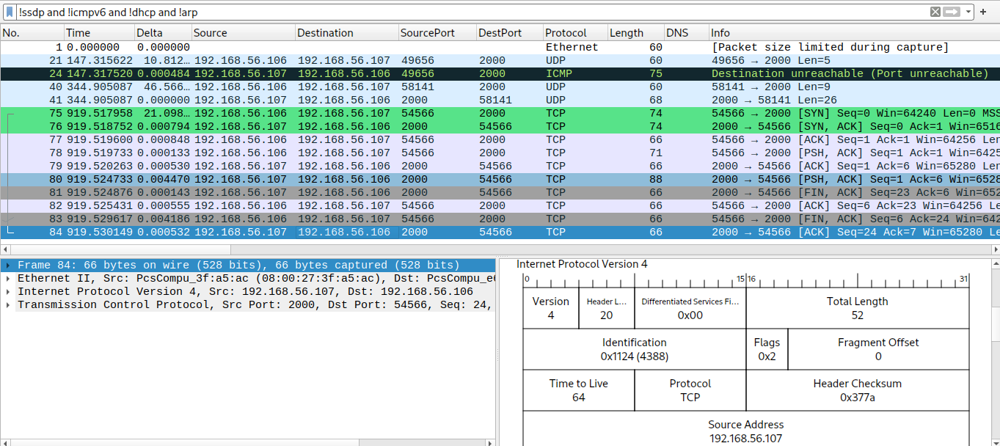

<!-- New section -->

## Guest additions

Le guest additions sono un software opzionale che aggiunge diverse funzionalità alle VM create con VirtualBox.

Vedremo nello specifico come installarle su un guest debian.
È sempre consigliabile fare queste operazioni sulla macchina virtuale originale, prima di effettuare cloni.

<!-- .element: class="fragment" -->

<!-- New subsection -->

### Installazione le dipendenze sulla macchina virtuale

Il primo passo consiste nell'assicurarsi che la VM abbia accesso ad internet.
La scheda di rete deve essere di tipo NAT, bridged o simili.

Successivamente si possono installare i pacchetti necessari.

<!-- .element: class="fragment" data-fragment-index="1" -->

```shell
root@vm:~$ apt update
root@vm:~$ apt install build-essential dkms linux-headers-$(uname -r)
```

<!-- .element: class="fragment" data-fragment-index="1" -->

<!-- New subsection -->

### Abilitare il copia-incolla da terminale

Se si lavora con una macchina virtuale senza interfaccia grafica, quindi solo con il terminale, la funzione di copia-incolla non sarà abilitata di default dopo aver installato le guest additions.
Sarà invece necessario installare alcuni pacchetti aggiuntivi.

```shell
root@vm:~$ apt x-window-system-core xclip
```

La nuova shell potrebbe utilizzare il layout della tastiera americano.
Per cambiarlo, si può usare il comando `setxkbmap`.

<!-- .element: class="fragment" data-fragment-index="1" -->

```shell
user@vm:~$ setxkbmap it
```

<!-- .element: class="fragment" data-fragment-index="1" -->

<!-- New subsection -->

#### Entrare nella nuova shell

Per poter verificare che tutto sia andato a buon fine, è necessario completare gli step successivi relativi all'installazione delle guest additions.

Abilitando la nuova shell con `startx`, sarà possibile copiare i testi dall'host ed incollarli nella VM con il tasto centrale del mouse (o premendo entrambi i tasti contemporaneamente).

<!-- .element: class="fragment" data-fragment-index="1" -->

```shell
user@vm:~$ startx
```

<!-- .element: class="fragment" data-fragment-index="1" -->

<!-- New subsection -->

### Inserire il disco delle guest additions

La _.iso_ delle guest addition può essere scaricata dal [sito ufficiale](https://download.virtualbox.org/virtualbox/).  
La versione da scaricare è quella che appare nella sezione `Help > About VirtualBox`.

Una volta scaricata, la _.iso_ può essere inserta nella VM.

<!-- .element: class="fragment" data-fragment-index="1" -->

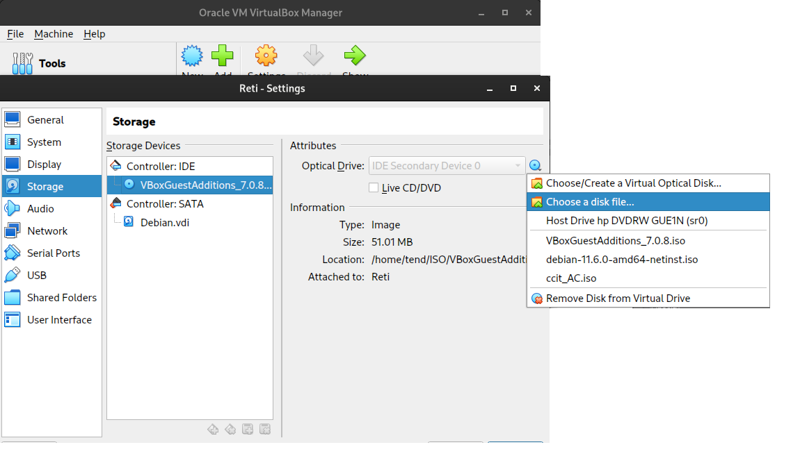

<!-- .element: class="fragment" data-fragment-index="1" -->

<!-- New subsection -->

### Montare ed installare

A questo punto è possibile montare il disco e installare le guest additions.

```shell
root@vm:~$ mkdir -p /mnt/cdrom
root@vm:~$ mount /dev/cdrom /mnt/cdrom
```

L'ultimo passaggio sarà quello di eseguire lo script di installazione

<!-- .element: class="fragment" data-fragment-index="1" -->

```shell
root@vm:~$ sh /mnt/cdrom/VBoxLinuxAdditions.run --nox11
```

<!-- .element: class="fragment" data-fragment-index="1" -->

Al prossimo riavvio, le guest additions saranno attive.
Per verificare che siano installate, si può usare il comando `lsmod`.

<!-- .element: class="fragment" data-fragment-index="2" -->

```shell
root@vm:~$ lsmod | grep vbox
vboxsf                 81920  0
vboxguest              40960  1 vboxsf
```

<!-- .element: class="fragment" data-fragment-index="2" -->

<!-- New section -->

## Cartelle condivise

Una funzionalità molto comoda messa a disposizione da VirtualBox è la possibilità di condividere una cartella tra host e guest.

In questa modalità, una cartella presente sull'host sarà visibile anche sulla VM.
In base alle impostazioni, sarà possibile leggere, scrivere o eseguire i file presenti, in modo che i cambiamenti siano visibili a tutte le macchine con accesso alla cartella.

<!-- .element: class="fragment" data-fragment-index="1" -->

<!-- New subsection -->

### Permessi

Per assicurarsi di avere i permessi per la gestione della cartella condivisa, sarà sufficiente aggiungere l'utente corrente alla lista degli utenti del gruppo `vboxsf`.

```shell
root@vm:~$ usermod -aG vboxsf user
```

<!-- New subsection -->

### Aggiungere una cartella condivisa

La cartella condivisa temporanea è una cartella che viene creata e distrutta ad ogni avvio della VM.

Per creare una cartella condivisa temporanea, bisogna andare nelle impostazioni della VM, nella sezione `Shared Folders`, e aggiungere una nuova cartella condivisa.

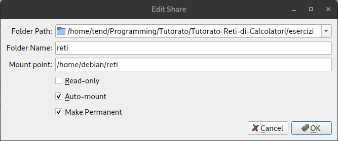

<!-- .element: class="fragment" -->

<!-- New subsection -->

### Opzioni

Le opzioni disponibili sono:

- **Folder Path**: percorso della cartella dell'host da condividere
- **Folder Name**: nome della cartella condivisa. Verrà usata per montarla nella VM
- **Mount Point**: percorso della cartella in cui verrà montata la cartella condivisa. Va lasciato vuoto per il montaggio automatico
- **Read Only**: rende la cartella condivisa in sola lettura per la VM
- **Auto-mount**: prova a montare la cartella condivisa all'avvio della VM, in `/media/sf_<folder name>`
- **Make Permanent**: rende la cartella condivisa permanente. Sarà disponibile anche dopo il riavvio della VM

<!-- New subsection -->

### Montaggio manuale

Se la cartella condivisa non viene montata automaticamente, è possibile farlo manualmente.

```shell
# Ci si assicura che il mount point sia un percorso valido
root@vm:~$ mkdir -p <mount point>
# Si monta la cartella condivisa
root@vm:~$ mount -t vboxsf -o uid=$UID <folder name> <mount point>
```

Questi passaggi dovranno essere ripetuti ad ogni avvio della VM.

<!-- .element: class="fragment" -->

<!-- New subsection -->

### Montaggio manuale all'avvio

Fare in modo che la cartella venga montata all'avvio della VM richiede qualche passaggio in più:

```shell
# Ottenere il proprio UID
user@vm:~$ echo $UID
# Editare il file /etc/fstab
root@vm:~$ nano /etc/fstab
```

```shell
# /etc/fstab
# Aggiungere la seguente riga, con le informazioni separate da un tab
<folder name>   <mount point>   vboxsf  uid=<$UID ottenuto prima>    0   0
```
