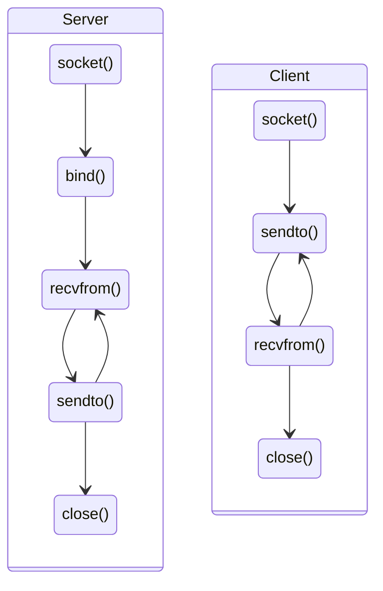
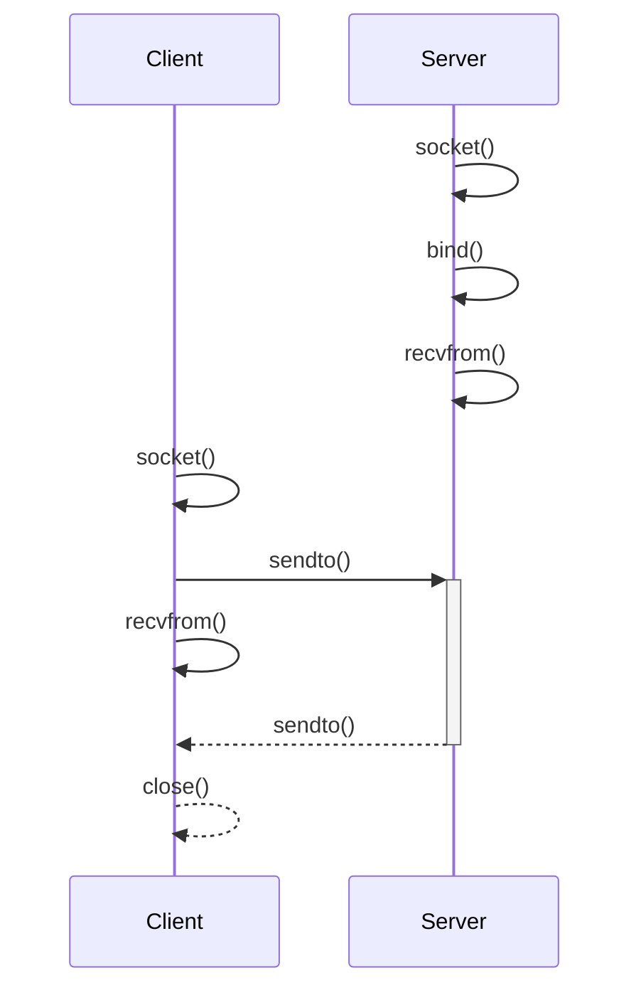
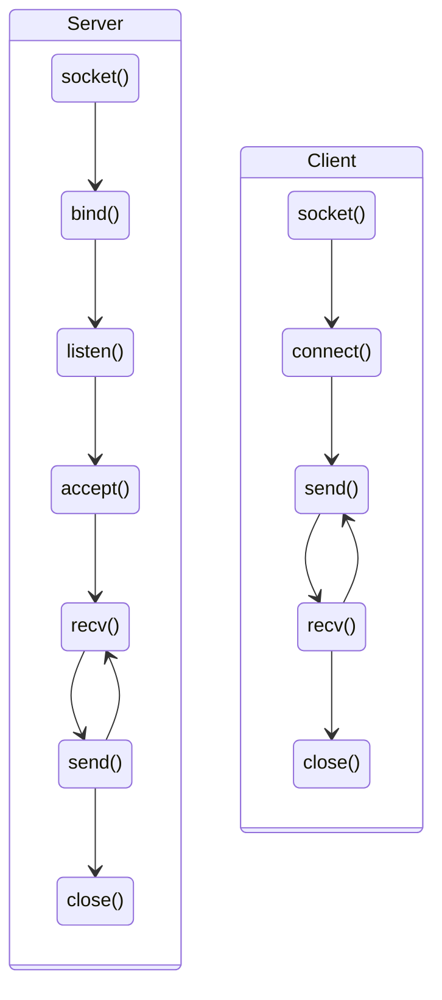
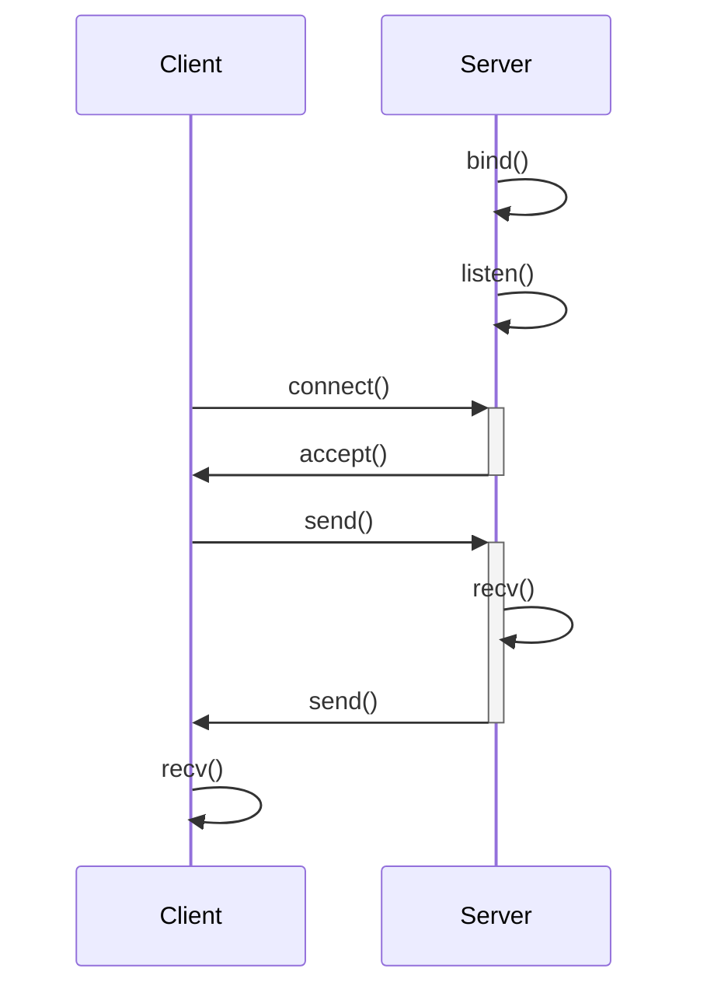

# Socket

Punto di contatto fra programmi nella rete.

<!-- New section -->

## Sockaddr

Struttura che contiene le informazioni necessarie per identificare un processo in una rete.

<!-- New subsection -->

### IPv4

```c
struct sockaddr_in {
    sa_family_t sin_family;    // AF_INET
    in_port_t sin_port;        // Porta di destinazione
    struct in_addr sin_addr;   // Indirizzo IPv4 di destinazione
    unsigned char sin_zero[8]; // Byte riservati
};
```

<!-- New subsection -->

### IPv6

```c
struct sockaddr_in6 {
    sa_family_t sin6_family;   // AF_INET6
    in_port_t sin6_port;       // Porta di destinazione
    uint32_t sin6_flowinfo;    // Informazioni di flusso
    struct in6_addr sin6_addr; // Indirizzo IPv6 di destinazione
    uint32_t sin6_scope_id;    // Identificatore di scope
};
```

Da notare che se si usa un indirizzo IPv6 _link local_, quelli fe80::/10, è necessario popolare l'indicatore di scope con l'indice dell'interfaccia di rete che si vuole usare.
In caso contrario, deve essere impostato a 0.

<!-- New subsection -->

### Popolare `sockaddr_in`

```c[|1,2|4,5|6|7,8|9-14|]
struct sockaddr_in addr4;
socklen_t addrlen = sizeof(addr4);

// memset() per impostare tutti i byte a 0
memset(&addr4, 0, addrlen);
addr4.sin_family = AF_INET;
// htons() per la conversione da host a network byte order
addr4.sin_port = htons(8080);
// inet_addr() per la conversione da stringa a bytes
addr4.sin_addr.s_addr = inet_addr("10.0.0.1");
// oppure
inet_pton(AF_INET, "10.0.0.1", &addr4.sin_addr);
// oppure, per accettare tutte le connessioni al server
addr4.sin_addr.s_addr = INADDR_ANY;
```

<!-- New subsection -->

### Popolare `sockaddr_in6`

```c[|1,2|4,5|6|7,8|9-12|13,14|]
struct sockaddr_in6 addr6;
socklen_t addrlen = sizeof(addr6);

// memset() per impostare tutti i byte a 0
memset(&addr6, 0, addrlen);
addr6.sin6_family = AF_INET6;
// htons() per la conversione da host a network byte order
addr6.sin6_port = htons(8080);
// inet_pton() per la conversione da stringa a bytes
inet_pton(AF_INET6, "2001:db8::1", &addr6.sin6_addr);
// oppure, per accettare tutte le connessioni al server
addr6.sin6_addr = in6addr_any;
// se si sta usando un ip link local
addr6.sin6_scope_id = if_nametoindex("enp0s3"); // o direttamente l'id numerico
```

<!-- New subsection -->

### Usare `getaddrinfo`

```c[|1|3|4|5|6,7|9-11|12-14|]
struct addrinfo hints, *res;

memset(&hints, 0, sizeof(hints));
hints.ai_family = AF_UNSPEC; // AF_INET o AF_INET6 per IPv4 o IPv6
hints.ai_socktype = SOCK_STREAM; // SOCK_STREAM o SOCK_DGRAM
// Si possono aggiungere varie flag in bitwise or per essere più specifici
hints.ai_flags = AI_PASSIVE; // l'indirizzo verrà usato per una bind

// getaddrinfo() per ottenere una lista di indirizzi
getaddrinfo("10.0.0.1", "8080", &hints, &res);

// res contiene un array di risultati
// res->ai_addr contiene il primo indirizzo
// res->ai_next contiene il puntatore al prossimo risultato
```

<!-- New section -->

## UDP

Protocollo di trasporto non orientato alla connessione.

Permette di inviare e ricevere messaggi con pochissimo overhead, senza però fornire garanzie rispetto alla consegna di questi ultimi.

<!-- New subsection -->

### Funzioni chiave: `socket()`

```c
int socket(int domain, int type, int protocol);
```

- `domain`: dominio di comunicazione:
  - **AF_INET** per IPv4
  - **AF_INET6** per IPv6
- `type`: tipo di comunicazione:
  - **SOCK_STREAM** per TCP
  - **SOCK_DGRAM** per UDP
- `protocol`: protocollo di comunicazione:
  - **0** per il protocollo di default
  - **IPPROTO_TCP** per TCP
  - **IPPROTO_UDP** per UDP

<!-- New subsection -->

### Funzioni chiave: `bind()`

```c
int bind(int sockfd, const struct sockaddr *addr, socklen_t addrlen);
```

- `sockfd`: descrittore di file della socket su cui fare la bind
- `addr`: indirizzo a cui fare la bind
- `addrlen`: dimensione della struttura `addr` in bytes

<!-- New subsection -->

### Funzioni chiave: `recvfrom()`

```c
ssize_t recvfrom(int sockfd, void *buf, size_t len, int flags, struct sockaddr *src_addr, socklen_t *addrlen);
```

- `sockfd`: descrittore di file della socket da cui ricevere i dati
- `buf`: buffer in cui salvare i dati ricevuti
- `len`: dimensione del buffer in bytes
- `flags`: flag di ricezione:
  - **0** per le flag di default
  - **MSG_WAITALL** per attendere la ricezione di tutti i dati
  - **MSG_DONTWAIT** per non attendere la ricezione di tutti i dati
- `src_addr`: indirizzo del mittente
- `addrlen`: dimensione della struttura `src_addr` in bytes

<!-- New subsection -->

### Funzioni chiave: `sendto()`

```c
ssize_t sendto(int sockfd, const void *buf, size_t len, int flags, const struct sockaddr *dest_addr, socklen_t addrlen);
```

- `sockfd`: descrittore di file della socket su cui inviare i dati
- `buf`: buffer contenente i dati da inviare
- `len`: dimensione del buffer in bytes
- `flags`: flag di invio:
  - **0** per le flag di default
  - **MSG_CONFIRM** per richiedere una conferma di ricezione
  - **MSG_DONTWAIT** per non attendere la conferma di ricezione
- `dest_addr`: indirizzo del destinatario
- `addrlen`: dimensione della struttura `dest_addr` in bytes

<!-- New subsection -->

### Funzioni chiave: `close()`

```c
int close(int sockfd);
```

- `sockfd`: descrittore di file della socket da chiudere

<!-- New subsection -->

### Sequenza di operazioni



<!-- New subsection -->

### Diagramma di sequenza



<!-- New section -->

## TCP

Protocollo di trasporto orientato alla connessione.

Offre delle garanzie rispetto alla consegna dei messaggi, gestendo eventuali errori o perdite, ma ha un overhead maggiore rispetto a UDP.

<!-- .element: class="fragment" -->

<!-- New subsection -->

### Funzioni chiave: `socket()`

```c
int socket(int domain, int type, int protocol);
```

- `domain`: dominio di comunicazione:
  - **AF_INET** per IPv4
  - **AF_INET6** per IPv6
- `type`: tipo di comunicazione:
  - **SOCK_STREAM** per TCP
  - **SOCK_DGRAM** per UDP
- `protocol`: protocollo di comunicazione:
  - **0** per il protocollo di default
  - **IPPROTO_TCP** per TCP
  - **IPPROTO_UDP** per UDP

<!-- New subsection -->

### Funzioni chiave: `bind()`

```c
int bind(int sockfd, const struct sockaddr *addr, socklen_t addrlen);
```

- `sockfd`: descrittore di file della socket su cui fare la bind
- `addr`: indirizzo a cui fare la bind
- `addrlen`: dimensione della struttura `addr` in bytes

<!-- New subsection -->

### Funzioni chiave: `listen()`

```c
int listen(int sockfd, int backlog);
```

- `sockfd`: descrittore di file della socket da cui accettare le connessioni
- `backlog`: numero massimo di connessioni in attesa di essere accettate

<!-- New subsection -->

### Funzioni chiave: `accept()`

```c
int accept(int sockfd, struct sockaddr *addr, socklen_t *addrlen);
```

- `sockfd`: descrittore di file della socket da cui accettare le connessioni
- `addr`: indirizzo del mittente
- `addrlen`: dimensione della struttura `addr` in bytes

<!-- New subsection -->

### Funzioni chiave: `connect()`

```c
int connect(int sockfd, const struct sockaddr *addr, socklen_t addrlen);
```

- `sockfd`: descrittore di file della socket che verrà usata in questa connessione
- `addr`: indirizzo del destinatario
- `addrlen`: dimensione della struttura `addr` in bytes

<!-- New subsection -->

### Funzioni chiave: `recv()` e `send()`

```c
ssize_t recv(int sockfd, void *buf, size_t len, int flags);
ssize_t send(int sockfd, const void *buf, size_t len, int flags);
```

- `sockfd`: descrittore di file della socket a cui si è connessi
- `buf`: buffer in cui salvare i dati ricevuti/da inviare
- `len`: dimensione del buffer in bytes
- `flags`: flag di ricezione/invio:
  - **0** per le flag di default
  - **MSG_WAITALL** per attendere la ricezione di tutti i dati
  - **MSG_DONTWAIT** per non attendere la ricezione di tutti i dati

<!-- New subsection -->

### Funzioni chiave: `close()`

```c
int close(int sockfd);
```

- `sockfd`: descrittore di file della socket da chiudere

<!-- New subsection -->

### Sequenza di operazioni



<!-- New subsection -->

### Diagramma di sequenza



<!-- New section -->

## Challenge
