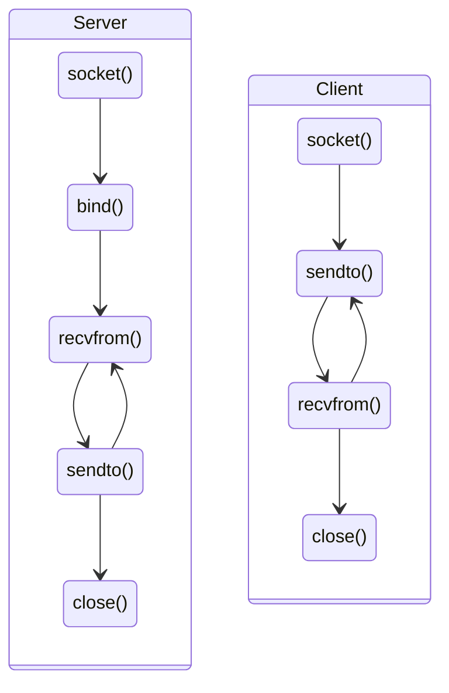
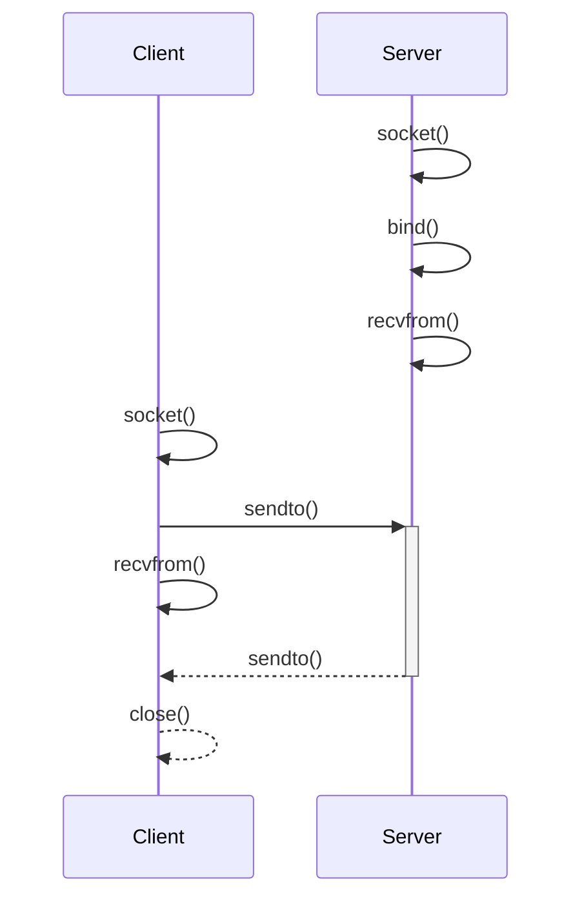

# Socket

Punto di contatto fra programmi nella rete.

<!-- New section -->

## UDP

Protocollo di trasporto non orientato alla connessione.

Permette di inviare e ricevere messaggi con pochissimo overhead, senza però fornire garanzie rispetto alla consegna di questi ultimi.

<!-- New subsection -->

### Funzioni chiave: `socket()`

```c
int socket(int domain, int type, int protocol);
```

- `domain`: dominio di comunicazione:
  - **AF_INET** per IPv4
  - **AF_INET6** per IPv6
- `type`: tipo di comunicazione:
  - **SOCK_STREAM** per TCP
  - **SOCK_DGRAM** per UDP
- `protocol`: protocollo di comunicazione:
  - **0** per il protocollo di default
  - **IPPROTO_TCP** per TCP
  - **IPPROTO_UDP** per UDP

<!-- New subsection -->

### Funzioni chiave: `bind()`

```c
int bind(int sockfd, const struct sockaddr *addr, socklen_t addrlen);
```

- `sockfd`: descrittore di file della socket su cui fare la bind
- `addr`: indirizzo a cui fare la bind
- `addrlen`: dimensione della struttura `addr` in bytes

<!-- New subsection -->

### Funzioni chiave: `recvfrom()`

```c
ssize_t recvfrom(int sockfd, void *buf, size_t len, int flags, struct sockaddr *src_addr, socklen_t *addrlen);
```

- `sockfd`: descrittore di file della socket da cui ricevere i dati
- `buf`: buffer in cui salvare i dati ricevuti
- `len`: dimensione del buffer in bytes
- `flags`: flag di ricezione:
  - **0** per le flag di default
  - **MSG_WAITALL** per attendere la ricezione di tutti i dati
  - **MSG_DONTWAIT** per non attendere la ricezione di tutti i dati
- `src_addr`: indirizzo del mittente
- `addrlen`: dimensione della struttura `src_addr` in bytes

<!-- New subsection -->

### Funzioni chiave: `sendto()`

```c
ssize_t sendto(int sockfd, const void *buf, size_t len, int flags, const struct sockaddr *dest_addr, socklen_t addrlen);
```

- `sockfd`: descrittore di file della socket su cui inviare i dati
- `buf`: buffer contenente i dati da inviare
- `len`: dimensione del buffer in bytes
- `flags`: flag di invio:
  - **0** per le flag di default
  - **MSG_CONFIRM** per richiedere una conferma di ricezione
  - **MSG_DONTWAIT** per non attendere la conferma di ricezione
- `dest_addr`: indirizzo del destinatario
- `addrlen`: dimensione della struttura `dest_addr` in bytes

<!-- New subsection -->

### Funzioni chiave: `close()`

```c
int close(int sockfd);
```

- `sockfd`: descrittore di file della socket da chiudere

<!-- New subsection -->

### Sequenza di operazioni



<!-- New subsection -->

### Diagramma di sequenza


