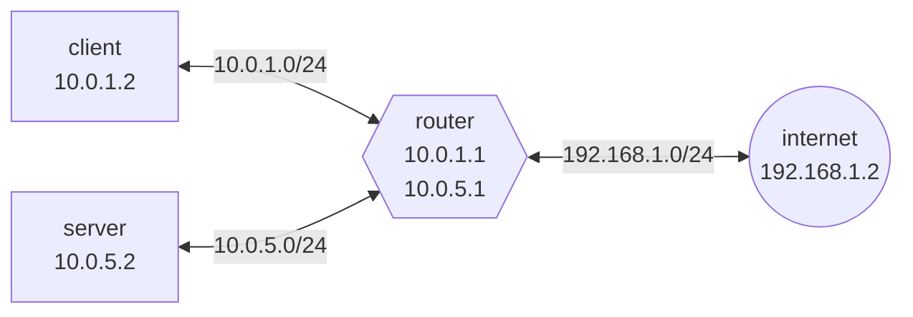

# Network

Come effettuare il setup di una rete locale.

<!-- New section -->

## Indirizzi IPv4

Gli indirizzi IPv4 sono dei numeri lunghi 32 bit che identificano univocamente un dispositivo all'interno di una rete.
Generalmente sono scritti in notazione puntata, dove ogni numero rappresenta un byte (8 bit).

$$
\underbrace{192}_{8\ bit}.\underbrace{168}_{8\ bit}.\underbrace{1}_{8\ bit}.\underbrace{1}_{8\ bit}
\newline \
\newline
\underbrace{\underbrace{11000000}_{8\ bit}.\underbrace{10101000}_{8\ bit}.\underbrace{00000001}_{8\ bit}.\underbrace{00000001}_{8\ bit}}_{32\ bit}
$$

<!-- New subsection -->

### Classi

La classificazione originale degli indirizzi IPv4 prevedeva una serie di classi.
Queste determinano la lunghezza del prefisso che identifica la rete.

| Classe | Prefisso | Indirizzi    | Hosts        | Maschera di rete |
| ------ | -------- | ------------ | ------------ | ---------------- |
| A      | 0        | $2^{31} - 2$ | $2^{24} - 2$ | $255.0.0.0$      |
| B      | 10       | $2^{30} - 2$ | $2^{16} - 2$ | $255.255.0.0$    |
| C      | 110      | $2^{29} - 2$ | $2^{8} - 2$  | $255.255.255.0$  |

<!-- New subsection -->

### Classless Inter-Domain Routing (CIDR)

Il CIDR è un sistema di notazione che permette di specificare la lunghezza del prefisso che identifica la rete in maniera più flessibile.

$$
\underbrace{192.168.1}_{24\ \text{bit di mask}}.1\ /\underbrace{24}_{\text{mask}} \\
\newline \
\newline
\underbrace{11000000.10101000.00000001}_{24\ \text{bit di mask}}.\underbrace{00000001}_{8\ \text{bit liberi}}\ /\underbrace{24}_{\text{mask}}
$$

<!-- New subsection -->

### Indirizzi speciali

Gli indirizzi speciali sono indirizzi che non possono essere assegnati a dispositivi, ma hanno un significato particolare.
Questi sono alcuni degli indirizzi speciali più comuni.

| Indirizzo                        | Descrizione   |
| -------------------------------- | ------------- |
| $127.0.0.0/8$                    | Loopback      |
| $10.0.0.0/8$                     | Locali        |
| $192.0.0.0/24$, $192.168.0.0/16$ | Locali        |
| $224.0.0.0/4$                    | Multicast     |
| $x.x.x.255/y$                    | Broadcast     |

<!-- New section -->

## Indirizzi IPv6

Gli indirizzi IPv6 sono dei numeri lunghi 128 bit che identificano univocamente un dispositivo all'interno di una rete.

$$
\underbrace{\underbrace{\underbrace{2}_{4 \ bit}001}_{16\ bit}:0db8:85a3:0000:0000:8a2e:0370:7334}\_{128\ bit}
$$

<!-- New subsection -->

### Notazione compressa

La notazione compressa permette di omettere gli zeri iniziali di ogni gruppo di 4 cifre.

$$
2001:0db8:85a3:0000:0000:8a2e:0370:7334
\newline
2001:db8:85a3:0:0:8a2e:370:7334
$$

Inoltre, è possibile omettere una sola sequenza di zeri consecutivi.

$$
2001:0db8:85a3:0000:0000:8a2e:0370:7334
\newline
2001:db8:85a3::8a2e:370:7334
$$

<!-- New subsection -->

### Indirizzi speciali

Gli indirizzi speciali sono indirizzi che non possono essere assegnati a dispositivi, ma hanno un significato particolare.
Questi sono alcuni degli indirizzi speciali più comuni.

| Indirizzo       | Descrizione      |
| --------------- | ---------------- |
| $::1$           | Loopback         |
| $::ffff:0:0/96$ | Compatibile IPv4 |
| $ff00::/8$      | Multicast        |
| $fe80::/10$     | Link-local       |

<!-- New section -->

## Setup di una rete

Per fare un po' di pratica e vedere i concetti base, effettueremo il setup di una rete locale con tre macchine virtuali:



<!-- New subsection -->

### Create the virtual machines

Prima di tutto è necessario creare le tre macchine virtuali.
Per velocizzare il processo, è possibile crearne una e clonarla due volte, prima di aver fatto alcuna configurazione.

Da questo momento in po, per comodità, le tre macchine verranno chiamate **client**, **router** e **server**.

<!-- .element: class="fragment" -->

<!-- New subsection -->

#### Configurazione delle schede di rete

Le tre macchine dovranno essere poste in reti interne differenti: una condivisa tra client e router ed una tra router e server.
Per potersi connettere ad internet, infine, il server dovrà avere una terza interfaccia che utilizza NAT.


<!-- New subsection -->

### Configurare le interfacce

Prima di tutto, è bene controllare quale interfaccia si sta utilizzando con il comando

```shell
ip a
```

Per comodità utilizzeremo le interfacce enp0s3 per client, server e router. Quest'ultimo sfrutterà anche l'interfaccia enp0s8.

<!-- New subsection -->

#### Client

La scheda di rete del client dovrà essere configurata in modo da usare la rete interna **client**.

Modificando il file _/etc/network/interfaces_ con nano o vi, è possibile configurare l'interfaccia in modo che utilizzi un ip statico.

```python
# Client /etc/network/interfaces
auto enp0s3
iface enp0s3 inet static
    address 10.0.1.2
    netmask 255.255.255.0
    gateway 10.0.1.1
```

Fare il reboot della macchina per applicare le modifiche.

```bash
reboot
```

<!-- New subsection -->

#### Router

Le tre schede di rete del router dovrebbero essere impostate a

1. la rete esterna tramite NAT
2. la rete interna **client**
3. la rete interna **server**

Modificare il file _/etc/network/interfaces_

```python
# Router /etc/network/interfaces
# ...
auto enp0s8
iface enp0s8 inet static
    address 10.0.1.1
    netmask 255.255.255.0

auto enp0s9
iface enp0s9 inet static
    address 10.0.5.1
    netmask 255.255.255.0
```

<!-- New subsection -->

#### Usare il routing

Per permettere al router di comportarsi come tale, e quindi di inoltrare i pacchetti diretti ad altre macchine, è necessario abilitare tale comportamento dal file _/etc/sysctl.conf_, rimuovendo il commento dalla riga _net.ipv4.ip_forward=1_.

```python
# Router /etc/sysctl.conf
net.ipv4.ip_forward=1
```

Anche in questo caso, è necessario riavviare la macchina per applicare le modifiche.

```bash
reboot
```

<!-- New subsection -->

#### Server

La scheda di rete del server dovrà essere configurata in modo da usare la rete interna **server**.

Modificare il file _/etc/network/interfaces_

```python
# Server /etc/network/interfaces
auto enp0s3
iface enp0s3 inet static
    address 10.0.5.2
    netmask 255.255.255.0
    gateway 10.0.5.1
```

Riavviare la macchina per applicare le modifiche.

```bash
reboot
```

<!-- New subsection -->

### Configurare il nome della macchina

Per comodità, è possibile configurare il nome della macchina in modo che sia più facile riconoscerla.
Basta modificare il file _/etc/hostname_.

```python
# Client /etc/hostname
client
```

```python
# Router /etc/hostname
router
```

```python
# Server /etc/hostname
server
```

<!-- New subsection -->

### Configurare gli hostnames

Invece di dover inserire ogni volta gli ip delle altre macchine, è possibile configurare gli hostnames.
Aggiungendo le coppie **ip-hostname** al file _/etc/hosts/_ è possibile associare il nome di una macchina all'ip corrispondente.

```python
# Client /etc/hosts/
10.0.1.1 router
10.0.5.2 server
```

```python
# Router /etc/hosts/
10.0.1.2 client
10.0.5.2 server
```

```python
# Server /etc/hosts/
10.0.5.1 router
10.0.1.2 client
```

<!-- New subsection -->

### Risultati

Se tutti i passaggi sono stati eseguiti correttamente, ora dovrebbe essere possibile pingare le macchine tra loro.
Usando il comando **traceroute** è possibile avere una visione più chiara della rete.

```shell
# dal client
traceroute 10.0.5.2
# dal server
traceroute 10.0.1.2
```

<!-- New subsection -->

### Extra: connettersi ad internet

Se si prova a accedere ad un server esterno, come google, da una delle VM che non sia il router, non si riceverà alcuna risposta.
Questo è perché, per poter inoltrare i pacchetti, il router deve permettere il NATting.
Per abilitare questa funzione, bisogna configurare correttamente le _IPTABLES_:

```bash
# Abilita il masquerading per l'interfaccia esterna
iptables --table nat --append POSTROUTING --out-interface enp0s3 -j MASQUERADE
# Abilita il forwarding dei pacchetti inoltrati
iptables --append FORWARD --in-interface enp0s3 -j ACCEPT
```

<!-- New section -->

## Cheatsheet

Una serie di comandi utili per configurare le reti su macchine debian.

<!-- New subsection -->

### Modificare le configurazioni dal terminale (modifiche temporanee)

Aggiungere un indirizzo ip ad un'interfaccia

```bash
# ip a add <ip>/<mask> dev <interface>
ip a add 10.0.1.5/24 dev enp0s8
```

Impostare un'interfaccia come up o down

```bash
# ip link set dev <interface> (up|down)
ip link set dev enp0s8 up
```

<!-- New subsection -->

#### Routing

Aggiungere, sostituire o rimuovere una route per una rete, specificando l'interfaccia o l'ip

```bash
# ip route (add|replace|del) <ip>/<mask> dev <interface>
ip route add 10.0.1.0/24 dev enp0s8
# ip route (add|replace|del) <ip>/<mask> via <ip>
ip route add 10.0.1.0/24 via 192.168.1.1
```

Aggiungere un gateway di default per ogni ip che non ha una route più specifica, specificando l'interfaccia o l'ip

```bash
# ip route (add|replace|del) default dev <interface>
ip route add default dev enp0s8
# ip route (add|replace|del) default via <ip>
ip route add default via 192.168.1.1
```

<!-- New subsection -->

### Modificare la configurazione di rete dal file (modifiche persistenti)

Modificare il file _/etc/network/interfaces_.
Si può usare qualsiasi editor di testo disponibile, ma probabilmente troverete già installati **vi** o **nano**.

```python
auto <interface>
iface <interface> inet static       # se impostato a 'dhcp', l'ip verrà assegnato dinamicamente
    address <ip>                    # ip della macchina legato a questa interfaccia
    netmask <mask>                  # maschera della rete (la parte /n)
    gateway <router ip>             # [SOLO SU UNA INTERFACCIA] imposta il gateway di default
    network <network>               # [OPZIONALE] definizione dalla rete. Default: ip/mask
    broadcast <broadcast address>   # [OPZIONALE] indirizzo di broadcast. Default: ip.255
    post-up <route up>              # [OPZIONALE] operazioni da fare quando l'interfaccia è messa su
    per-down <route down>           # [OPZIONALE] operazioni da fare quando l'interfaccia è messa giù

auto enp0s8
iface enp0s8 inet static
    address 10.0.1.2
    netmask 255.255.255.0
    gateway 10.0.1.1
    network 10.0.1.0
    broadcast 10.0.1.255
    post-up route add -net 10.0.1.0 netmask 255.255.255.0 gw 10.0.1.1 dev enp0s8
    per-down route del -net 10.0.1.0 netmask 255.255.255.0 gw 10.0.1.1 dev enp0s8
```

<!-- New subsection -->

### Impostare gli hostnames

Per aggiungere dei nomi da associare agli ip, si può modificare il file _/etc/hosts_, aggiungendo le coppie **ip-hostname** sotto le righe già presenti

```python
127.0.0.1       localhost
::1             localhost ip6-localhost

# <ip> <hostnames>
10.0.0.1 router
192.168.1.2 server
```

<!-- New section -->

## Challenge
