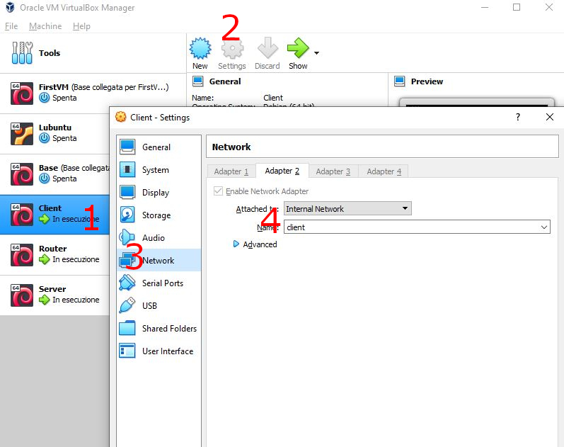

# Network

Come effettuare il setup di una rete locale.

<!-- New section -->

## Indirizzi IPv4

Gli indirizzi IPv4 sono dei numeri lunghi 32 bit che identificano univocamente un dispositivo all'interno di una rete.
Generalmente sono scritti in notazione puntata, dove ogni numero rappresenta un byte (8 bit).

```math
\begin{gather*}
\underbrace{192}_{8\ bit}.\underbrace{168}_{8\ bit}.\underbrace{1}_{8\ bit}.\underbrace{1}_{8\ bit}
\newline \space
\newline
\underbrace{\underbrace{11000000}_{8\ bit}.\underbrace{10101000}_{8\ bit}.\underbrace{00000001}_{8\ bit}.\underbrace{00000001}_{8\ bit}}_{32\ bit}
\end{gather*}
```

<!-- New subsection -->

### Classi

La classificazione originale degli indirizzi IPv4 prevedeva una serie di classi.
Queste determinano la lunghezza del prefisso che identifica la rete.

| Classe | Prefisso | Indirizzi    | Hosts        | Maschera di rete |
| ------ | -------- | ------------ | ------------ | ---------------- |
| A      | 0        | $2^{31} - 2$ | $2^{24} - 2$ | $255.0.0.0$      |
| B      | 10       | $2^{30} - 2$ | $2^{16} - 2$ | $255.255.0.0$    |
| C      | 110      | $2^{29} - 2$ | $2^{8} - 2$  | $255.255.255.0$  |

<!-- New subsection -->

### Classless Inter-Domain Routing (CIDR)

Il CIDR è un sistema di notazione che permette di specificare la lunghezza del prefisso che identifica la rete in maniera più flessibile.

```math
\begin{gather*}
\underbrace{192.168.1}_{24\ \text{bit di mask}}.1\ /\underbrace{24}_{\text{mask}} \newline
\newline \space
\newline
\underbrace{11000000.10101000.00000001}_{24\ \text{bit di mask}}.\underbrace{00000001}_{8\ \text{bit liberi}}\ /\underbrace{24}_{\text{mask}}
\end{gather*}
```

<!-- New subsection -->

### Notazione della maschera

Se posta alla fine di un indirizzo, generalmente si usa la versione con lo slash.
Se invece viene scritta da sola, si usa la notazione puntata.

| Notazione | Esempio                             |
| --------- | ----------------------------------- |
| Slash     | /24                                 |
| Puntata   | 255.255.255.0                       |
| Binaria   | 11111111.11111111.11111111.00000000 |
| Slash     | /25                                 |
| Puntata   | 255.255.255.128                     |
| Binaria   | 11111111.11111111.11111111.10000000 |

<!-- New subsection -->

### Albero delle sotto-reti

Una rete, individuata dalla parte dell'ip fissata dalla maschera, può essere ulteriormente divisa in sotto-reti che condividono la stessa sequenza iniziale, ma con una maschera più lunga.


<!-- New subsection -->

### Indirizzi speciali

Gli indirizzi speciali sono indirizzi che non possono essere assegnati a dispositivi, ma hanno un significato particolare.
Questi sono alcuni degli indirizzi speciali più comuni.

| Indirizzo                        | Descrizione |
| -------------------------------- | ----------- |
| $127.0.0.0/8$                    | Loopback    |
| $10.0.0.0/8$                     | Locali      |
| $192.0.0.0/24$, $192.168.0.0/16$ | Locali      |
| $224.0.0.0/4$                    | Multicast   |
| $x.x.x.255/y$                    | Broadcast   |

<!-- New section -->

## Indirizzi IPv6

Gli indirizzi IPv6 sono dei numeri lunghi 128 bit che identificano univocamente un dispositivo all'interno di una rete.

```math
\begin{gather*}
\underbrace{\underbrace{\underbrace{2}_{4 \ bit}001}_{16\ bit}:0db8:85a3:0000:0000:8a2e:0370:7334}_{128\ bit}
\newline \space
\newline
\underbrace{0}_{0000}
\underbrace{1}_{0001}
\underbrace{2}_{0010}
\underbrace{3}_{0011}
\underbrace{4}_{0100}
\underbrace{5}_{0101}
\underbrace{6}_{0110}
\underbrace{7}_{0111}
\underbrace{8}_{1000}
\underbrace{9}_{1001}
\underbrace{a}_{1010}
\underbrace{b}_{1011}
\underbrace{c}_{1100}
\underbrace{d}_{1101}
\underbrace{e}_{1110}
\underbrace{f}_{1111}
\end{gather*}
```

<!-- New subsection -->

### Notazione compressa

La notazione compressa permette di omettere gli zeri iniziali di ogni gruppo di 4 cifre.

$$
\begin{gather*}
2001:0db8:85a3:0000:0000:8a2e:0370:7334
\newline
2001:db8:85a3:0:0:8a2e:370:7334
\end{gather*}
$$

Inoltre, è possibile omettere una sola sequenza di zeri consecutivi.

$$
\begin{gather*}
2001:0db8:85a3:0000:0000:8a2e:0370:7334
\newline
2001:db8:85a3::8a2e:370:7334
\end{gather*}
$$

<!-- New subsection -->

### Maschere in IPv6

Le maschere in IPv6 sono rappresentate da un numero che indica il numero di bit che compongono l'identificativo della rete.

```math
\underbrace{2001:db8:85a3::8a2e}_{96 \text{ bit di maschera}}:370:7334/96
```

Bisogna stare attenti a ricordare che ogni cifra esadecimale corrisponde a 4 bit.
La maschera potrebbe anche dividere la cifra nel mezzo.

```math
\underbrace{2001:db8:85a3::8a2e:0\underbrace{3}_{001}}_{103 \text{ bit di maschera}}\underbrace{ }_{1}70:7334/103
```

<!-- New subsection -->

### Albero delle sotto-reti

Anche in IPv6 è possibile dividere una rete in sotto-reti, seguendo le stesse regole di IPv4 con una struttura ad albero.


<!-- New subsection -->

### Differenziare le reti noti il numero di host

Un altro metodo più semplice per differenziare le reti è quello di notare il numero di host che si vuole avere in ogni rete.
Stabilito il numero di bit necessari ad identificarli, il resto dell'indirizzo sarà utilizzato per identificare la rete.
Va però invertito l'ultimo bit catturato della maschera rispetto all'ip originale.  
Finché tutte le reti hanno una maschera differente, non ci saranno conflitti.

<!-- New subsection -->

#### Esempio

Si vuole dividere la rete 2:4::FFF0:0:0/96 in 4 reti con 500.000, 50.000, 2.500.000 e 700.000 di host.

$0002:0004:0000:0000:0000:FFF0:0000:0000$

```math
\begin{gather*}
\lceil\log_2{500000}\rceil = 19 \to 128 - 19 = 109
\newline
\underbrace{0002:0004:0000:0000:0000:FFF0:000}_{108 \text{ bit}}\underbrace{8}_{1000}:0000 / 109
\end{gather*}
```

```math
\begin{gather*}
\lceil\log_2{50000}\rceil = 16 \to 128 - 16 = 112
\newline
\underbrace{0002:0004:0000:0000:0000:FFF0:000}_{108 \text{ bit}}\underbrace{1}_{0001}:0000 / 112
\end{gather*}
```

<!-- New subsection -->

#### Esempio - continuazione

```math
\begin{gather*}
\lceil\log_2{2500000}\rceil = 22 \to 128 - 22 = 106
\newline
\underbrace{0002:0004:0000:0000:0000:FFF0:00}_{104 \text{ bit}}\underbrace{4}_{0100}0:0000 / 106
\end{gather*}
```

```math
\begin{gather*}
\lceil\log_2{700000}\rceil = 20 \to 128 - 20 = 108
\newline
\underbrace{0002:0004:0000:0000:0000:FFF0:00}_{104 \text{ bit}}\underbrace{1}_{0001}0:0000 / 108
\end{gather*}
```

<!-- New subsection -->

### Indirizzi speciali

Gli indirizzi speciali sono indirizzi che non possono essere assegnati a dispositivi, ma hanno un significato particolare.
Questi sono alcuni degli indirizzi speciali più comuni.

| Indirizzo       | Descrizione      |
| --------------- | ---------------- |
| $::1$           | Loopback         |
| $::ffff:0:0/96$ | Compatibile IPv4 |
| $ff00::/8$      | Multicast        |
| $fe80::/10$     | Link-local       |

<!-- New section -->

## Setup di una rete

Per fare un po' di pratica e vedere i concetti base, effettueremo il setup di una rete locale con tre macchine virtuali:


<!-- New subsection -->

### Creare le macchine virtuali

Prima di tutto è necessario creare le tre macchine virtuali.
Per velocizzare il processo, è possibile crearne una e clonarla due volte, prima di aver fatto alcuna configurazione.

Da questo momento in poi, per comodità, le tre macchine verranno chiamate **client**, **router** e **server**.

<!-- .element: class="fragment" -->

<!-- New subsection -->

#### Configurazione delle schede di rete

Le tre macchine dovranno essere poste in reti interne differenti: una condivisa tra client e router ed una tra router e server.  
Se si vuole anche abilitare la connessione ad internet, il router dovrà avere una terza interfaccia che utilizza NAT.



<!-- New subsection -->

### Configurare le interfacce

Prima di tutto, è bene controllare quale interfaccia si sta utilizzando con il comando

```shell
ip a
```

Per comodità utilizzeremo le interfacce enp0s3 per client, server e router. Quest'ultimo sfrutterà anche l'interfaccia enp0s8.

<!-- New subsection -->

#### Client

La scheda di rete del client dovrà essere configurata in modo da usare la rete interna **lan1**.

Modificando il file _/etc/network/interfaces_ con nano o vi, è possibile configurare l'interfaccia in modo che utilizzi un ip statico.

```python
# Client /etc/network/interfaces
auto enp0s3
iface enp0s3 inet static
    address 10.0.1.1/24
    gateway 10.0.1.254
```

Fare il reboot della macchina per applicare le modifiche.

```bash
reboot
```

<!-- New subsection -->

#### Router

Le due schede di rete del router dovrebbero essere impostate a

1. la rete interna **lan1**
1. la rete interna **lan2**

Modificare il file _/etc/network/interfaces_

```python
# Router /etc/network/interfaces
# ...
auto enp0s3
iface enp0s3 inet static
    address 10.0.1.254/24

auto enp0s8
iface enp0s8 inet static
    address 192.168.1.254/24
```

<!-- New subsection -->

#### Usare il routing

Per permettere al router di comportarsi come tale, e quindi di inoltrare i pacchetti diretti ad altre macchine, è necessario abilitare tale comportamento dal file _/etc/sysctl.conf_, rimuovendo il commento dalla riga _net.ipv4.ip_forward=1_.

```python
# Router /etc/sysctl.conf
net.ipv4.ip_forward=1
```

Anche in questo caso, è necessario riavviare la macchina per applicare le modifiche.

```bash
reboot
```

<!-- New subsection -->

#### Tabelle di routing

Se la topologia della rete è più complicata, potrebbe essere necessario inoltrare il pacchetto attraverso più router.  
Ogni router dovrebbe conoscere la route per raggiungere ogni altra macchina della rete.
Per le reti a cui non ha direttamente accesso, la route potrebbe dover essere impostata manualmente.

```python
# Router /etc/network/interfaces
# ...
# Con questa regola di routing
# i pacchetti che diretti alla lan 172.0.1.0/24
# saranno inoltrati al router 10.0.1.253
up ip route add 172.0.1.0/24 via 10.0.1.253
```

<!-- New subsection -->

#### Server

La scheda di rete del server dovrà essere configurata in modo da usare la rete interna **lan2**.

Modificare il file _/etc/network/interfaces_

```python
# Server /etc/network/interfaces
auto enp0s3
iface enp0s3 inet static
    address 192.168.1.1/24
    gateway 192.168.1.254
```

Riavviare la macchina per applicare le modifiche.

```bash
reboot
```

<!-- New subsection -->

### Configurare gli hostnames

Invece di dover inserire ogni volta gli ip delle altre macchine, è possibile configurare gli hostnames.
Aggiungendo le coppie **ip-hostname** al file _/etc/hosts_ è possibile associare il nome di una macchina all'ip corrispondente.

```python
# Client /etc/hosts/
10.0.1.1 router
10.0.5.2 server
```

```python
# Router /etc/hosts/
10.0.1.2 client
10.0.5.2 server
```

```python
# Server /etc/hosts/
10.0.5.1 router
10.0.1.2 client
```

<!-- New subsection -->

### Configurare il nome della macchina

Per comodità, è possibile configurare il nome della macchina in modo che sia più facile riconoscerla.
Basta modificare il file _/etc/hostname_.
Se lo fate, è bene aggiornare il file _/etc/hosts_ così che il nuovo nome della macchina sia associato all'ip di loopback.

```python
# Client /etc/hostname
client
# Client /etc/hosts
127.0.0.1 client
```

```python
# Router /etc/hostname
router
# Router /etc/hosts
127.0.0.1 router
```

```python
# Server /etc/hostname
server
# Server /etc/hosts
127.0.0.1 server
```

<!-- New subsection -->

### Risultati

Se tutti i passaggi sono stati eseguiti correttamente, ora dovrebbe essere possibile pingare le macchine tra loro.
Usando il comando **traceroute** è possibile avere una visione più chiara della rete.

```shell
# dal client
traceroute 192.168.1.1
# dal server
traceroute 10.0.1.1
```

<!-- New subsection -->

### Extra: connettersi ad internet

Se si prova a accedere ad un server esterno, come google, da una delle VM che non sia il router, non si riceverà alcuna risposta.
Questo è perché, per poter inoltrare i pacchetti, il router deve permettere il NATting.
Per abilitare questa funzione, bisogna configurare correttamente le _IPTABLES_:

```bash
# Abilita il masquerading per l'interfaccia esterna
iptables --table nat --append POSTROUTING --out-interface enp0s3 -j MASQUERADE
# Abilita il forwarding dei pacchetti inoltrati
iptables --append FORWARD --in-interface enp0s3 -j ACCEPT
```

<!-- New section -->

## Cheatsheet

Una serie di comandi utili per configurare le reti su macchine debian.

<!-- New subsection -->

### Modificare le configurazioni dal terminale (modifiche temporanee)

Aggiungere un indirizzo ip ad un'interfaccia

```bash
# ip a add <ip>/<mask> dev <interface>
ip a add 10.0.1.5/24 dev enp0s8
```

Impostare un'interfaccia come up o down

```bash
# ip link set dev <interface> (up|down)
ip link set dev enp0s8 up
```

<!-- New subsection -->

#### Routing

Aggiungere, sostituire o rimuovere una route per una rete, specificando l'interfaccia o l'ip

```bash
# ip route (add|replace|del) <ip>/<mask> dev <interface>
ip route add 10.0.1.0/24 dev enp0s8
# ip route (add|replace|del) <ip>/<mask> via <ip>
ip route add 10.0.1.0/24 via 192.168.1.1
```

Aggiungere un gateway di default per ogni ip che non ha una route più specifica, specificando l'interfaccia o l'ip

```bash
# ip route (add|replace|del) default dev <interface>
ip route add default dev enp0s8
# ip route (add|replace|del) default via <ip>
ip route add default via 192.168.1.1
```

<!-- New subsection -->

### Modificare la configurazione di rete dal file (modifiche persistenti)

Modificare il file _/etc/network/interfaces_.
Si può usare qualsiasi editor di testo disponibile, ma probabilmente troverete già installati **vi** o **nano**.

```python
# /etc/network/interfaces
auto <interface>
iface <interface> inet static       # se impostato a 'dhcp', l'ip verrà assegnato dinamicamente
    address <ip>                    # ip della macchina legato a questa interfaccia. Si può aggiungere anche la mask /n
    netmask <mask>                  # maschera della rete (la parte /n)
    gateway <router ip>             # [SOLO SU UNA INTERFACCIA] imposta il gateway di default
    network <network>               # [OPZIONALE] definizione dalla rete. Default: ip/mask
    broadcast <broadcast address>   # [OPZIONALE] indirizzo di broadcast. Default: ip.255
    up <route up>                   # [OPZIONALE] operazioni da fare quando l'interfaccia è messa su
    post-up <route up>              # [OPZIONALE] operazioni da fare dopo che l'interfaccia è messa su
    per-down <route down>           # [OPZIONALE] operazioni da fare quando l'interfaccia è messa giù
```

<!-- New subsection -->

#### Esempi di file di configurazione

File _/etc/network/interfaces_:

```python
auto enp0s3
iface enp0s3 inet dhcp
```

```python
auto enp0s8
iface enp0s8 inet static
    address 10.0.1.2/24
    gateway 10.0.1.1
    up ip route add 192.168.1.1/24 via 10.0.1.254
```

```python
auto enp0s9
iface enp0s9 inet static
    address 10.0.1.2
    netmask 255.255.255.0
    gateway 10.0.1.1
    network 10.0.1.0
    broadcast 10.0.1.255
    post-up route add -net 10.0.1.0 netmask 255.255.255.0 gw 10.0.1.1 dev enp0s8
    per-down route del -net 10.0.1.0 netmask 255.255.255.0 gw 10.0.1.1 dev enp0s8
```

<!-- New subsection -->

### Impostare gli hostnames

Per aggiungere dei nomi da associare agli ip, si può modificare il file _/etc/hosts_, aggiungendo le coppie **ip-hostname** sotto le righe già presenti

```python
127.0.0.1       localhost
::1             localhost ip6-localhost
127.0.0.1       <hostname>

# <ip> <hostnames>
10.0.0.1 router
192.168.1.2 server
```

<!-- New section -->

## Troubleshooting

Anche se vorremmo che tutto funzionasse al primo colpo, non è sempre così.
Vediamo alcuni passaggi che possono essere utili per individuare e risolvere i problemi.

<!-- New subsection -->

### Verificare la configurazione di rete da VirtualBox

La prima cosa da controllare è che le macchine siano collegate alla rete corretta.  
Se due macchine non sono inserite nella stessa rete interna, non potranno mai raggiungersi direttamente.


<!-- New subsection -->

### Verificare la configurazione di rete dei router da VirtualBox

Per poter svolgere il loro compito, i router devono avere tante interfacce quante sono le reti per cui devono inoltrare i pacchetti.

L'ordine in cui sono collegate le interfacce è importante, perché determina quale interfaccia sarà collegata a quale rete.

<!-- New subsection -->

### Verificare la configurazione IP

Dopo aver configurato l'ip di una macchina, usando i comandi da riga di comando `ip a add` o modificando il file _/etc/network/interfaces_, è una buona idea accertarsi, che la configurazione sia stata applicata correttamente.

Per farlo, si può usare il comando _ip a_.

```bash
ip a
```

<!-- New subsection -->

### Verificare la configurazione di routing

Dopo aver configurato le rotte di una macchina, usando i comandi da riga di comando `ip r add `o modificando il file _/etc/network/interfaces_, è una buona idea accertarsi, che la configurazione sia stata applicata correttamente.

Per farlo, si può usare il comando _ip r_.

```bash
ip r
```

<!-- New subsection -->

### Utilizzare il comando ping

Il comando _ping_ è un ottimo strumento per verificare la connettività tra due macchine.

```bash
ping <ip>
```

Il primo step è verificare che le macchine nella stessa rete siano raggiungibili.
In particolare, che il router sia raggiungibile da tutte le macchine collegate ad esso.

<!-- New subsection -->

#### Problemi con il ping

Se la risposta è che l'host è irraggiungibile, allora probabilmente manca il gateway di default.

Se non si riceve risposta, la macchina di destinazione potrebbe essere spenta, o il router potrebbe non aver abilitato il forwarding dei pacchetti.

Un'altra opzione sarebbe che il destinatario non abbia modo di fare il percorso inverso per rispondere al ping (magari non ha un gateway impostato).

<!-- New subsection -->

### Utilizzare il comando traceroute

Il comando _traceroute_ è un ottimo strumento che permette di tracciare il percorso che un pacchetto compie per raggiungere una destinazione.

```bash
traceroute <ip>
```

<!-- New section -->

## Challenge

- Sistemare il routing per ipv6
