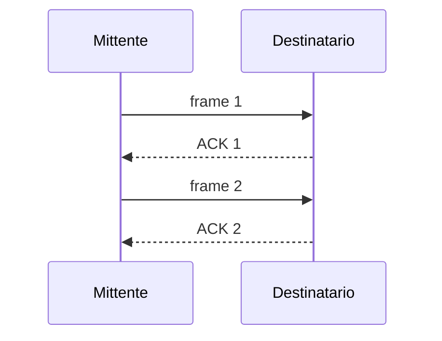
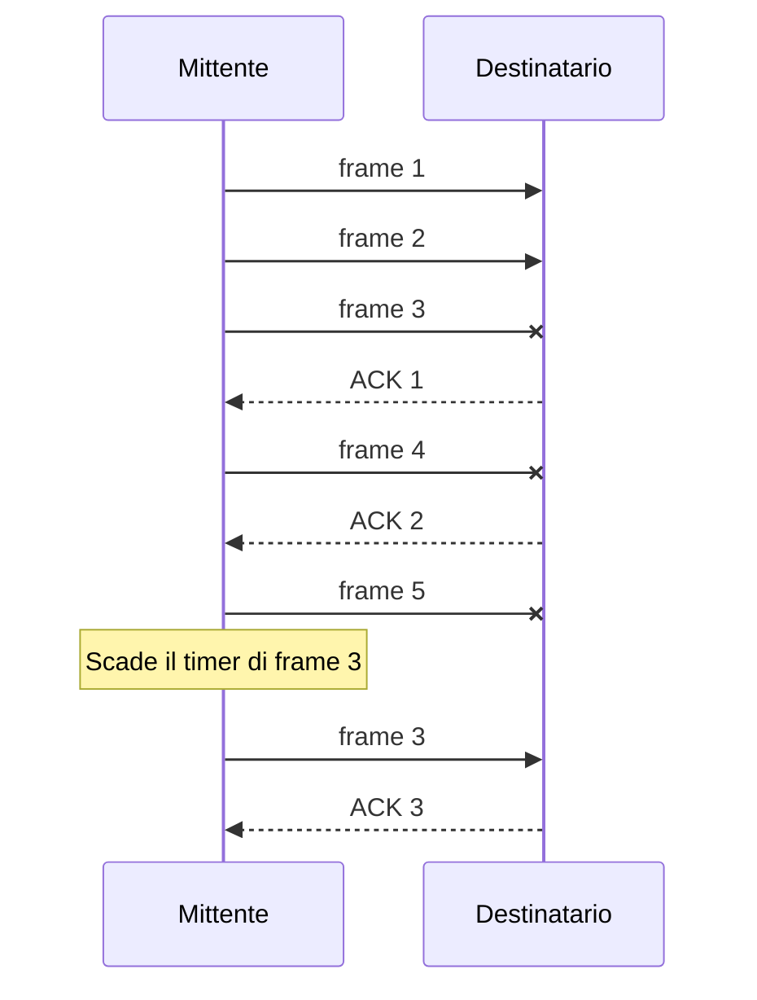

# Esercizi

Esercizi di teoria.

<!-- New section -->

## Formulario

Lista di formule generali per risolvere gli esercizi.

<!-- New subsection -->

### Legenda

$$
\begin{array}{ll}
BW & \text{Banda (bps)}
\newline
BW_{s \to d} & \text{Banda dalla sorgente alla destinazione (bps)}
\newline
BW_{d \to s} & \text{Banda dalla destinazione alla sorgente (bps)}
\newline
BW_e & \text{Banda effettiva (bps)}
\newline
\newline
T_p & \text{Ritardo di propagazione (s)}
\newline
T_{tf} & \text{Ritardo di trasmissione frame (s)}
\newline
T_{ta} & \text{Ritardo di trasmissione ACK (s)}
\newline
T_{e} & \text{Ritardo dovuto ad errori (s)}
\newline
RTT & \text{Round Trip Time (s)}
\end{array}
$$

<!-- New subsection -->

### Legenda

$$
\begin{array}{ll}
I & \text{Intestazione (bit)}
\newline
P & \text{Payload (bit)}
\newline
L & \text{Perdita (percentuale)}
\newline
t & \text{Timer (s)}
\newline
W & \text{Finestra (pacchetti)}
\newline
N_f & \text{Numero di frame effettivo in una finestra (pacchetti)}
\end{array}
$$

<!-- New subsection -->

### Tempi senza errori

$$
T_p = \frac{\text{Lunghezza da percorrere}}{\text{Velocità del segnale}}
\newline \space
\newline
T_{tf} = \frac{I + P}{BW_{s \to d}}
\newline \space
\newline
T_{ta} = \frac{I}{BW_{d \to s}}
\newline \space
\newline
RTT = 2 \cdot T_p + T_{tf} + T_{ta}
$$

<!-- New subsection -->

### Tempi in presenza di errori

$$
\begin{array}{ll}
T_e = 2 \cdot L \cdot t
\newline \space
\newline
RTT = 2 \cdot T_p + T_{tf} + T_{ta} + T_e
\end{array}
$$

<!-- New subsection -->

### Banda effettiva

$$
BW_e = \frac{P}{RTT}
\newline \space
\newline
BW_e = \frac{P}{2 \cdot T_p + T_{tf} + T_{ta} + T_e}
\newline \space
\newline
BW_e = \frac{P}{2 \cdot T_p + \frac{I + P}{BW_{s \to d}} + \frac{I}{BW_{d \to s}} + 2 \cdot L \cdot t}
$$

<!-- New subsection -->

### Banda effettiva con finestra (Go-Back-N)

$$
\begin{array}{ll}
N_f = \frac{RTT}{T_{tf}}
\end{array}
\newline \space
\newline
\begin{cases}
BW_e = \frac{W \cdot P}{RTT} & \text{se } W \leq N_f
\newline \space
\newline
BW_e = \frac{\lfloor N_f \rfloor \cdot P}{RTT} & \text{se } W > N_f
\end{cases}
$$

<!-- New section -->

## Protocollo stop-and-wait

Un protocollo stop-and-wait è un protocollo di comunicazione che prevede che il mittente invii un pacchetto e attenda la ricezione di un ACK prima di inviare il pacchetto successivo.

<!-- New subsection -->

### Esercizio 1

$$
\begin{array}{lll}
\text{Banda}(BW) &= 8 \text{ Mbps} &= 8 \cdot 10^6 \text{ bps}
\newline
\text{Ritardo di propagazione}(T_p) &= 10 \text{ ms} &= 10^{-2} \text{ s}
\newline
\text{Intestazione}(I) &= 10 \text{ byte} &= 80 \text{ bit}
\newline
\text{Banda effettiva}(BW_e) &= 5 \text{ Mbps} &= 5 \cdot 10^6 \text{ bps}
\newline
\text{Timer}(t) &= 100 \text{ ms} &= 10^{-1} \text{ s}
\newline
\text{Perdita}(L) &= 0.01
\end{array}
$$

$$
\begin{array}{ll}
\text{Ritardo di trasmissione frame}(T_{tf}) &= \text{ ?}
\newline
\text{Ritardo di trasmissione ACK}(T_{ta}) &= \text{ ?}
\newline
\text{Dimensione Payload}(P) &= \text{ ?}
\end{array}
$$

<!-- New subsection -->

### Schema

<!-- New subsection -->

### Formule

$$
\begin{array}{lll}
& BW_e &=
\newline
\newline
=& \frac{P}{2 \cdot T_p + T_{tf} + T_{ta} + L \cdot 2 \cdot t} &=
\newline
\newline
=& \frac{P}{2 \cdot T_p + \frac{I + P}{BW} + \frac{I}{BW} + L \cdot 2 \cdot t}
\end{array}
$$

<!-- New subsection -->

### Ricavare P

$$
\begin{array}{ll}
BW_e(2 \cdot T_p + \frac{I + P}{BW} + \frac{I}{BW} + L \cdot 2 \cdot t) &= P
\newline
BW_e \cdot BW(2 \cdot T_p + \frac{I + P}{BW} + \frac{I}{BW} + L \cdot 2 \cdot t) &= BW \cdot P
\newline
BW_e ( BW \cdot 2 \cdot T_p + I + P + I + BW \cdot L \cdot 2 \cdot t) &= BW \cdot P
\newline
BW_e \cdot P + 2 \cdot BW_e ( BW \cdot T_p + I + BW \cdot L \cdot t) &= BW \cdot P
\newline
2 \cdot BW_e ( BW \cdot T_p + I + BW \cdot L \cdot t) &= BW \cdot P - BW_e \cdot P
\newline
2 \cdot BW_e ( BW \cdot T_p + I + BW \cdot L \cdot t) &= (BW - BW_e) \cdot P
\newline
\frac{2 \cdot BW_e ( BW \cdot T_p + I + BW \cdot L \cdot t)}{BW - BW_e} &= P
\newline
\frac{10 \cdot 10^6 ( 8 \cdot 10^4 + 80 + 8 \cdot 10^3)}{3 \cdot 10^6} &= P
\end{array}
$$

$$
P = 293600 \text{ bit}
\newline
P = 36700 \text{ byte}
$$

<!-- New section -->

## Protocollo go back n

Un protocollo go back n è un protocollo di comunicazione che prevede che il mittente invii un pacchetto certo numero di pacchetti e attenda la ricezione di un ACK prima di inviarne un altro. In caso di perdita di un pacchetto, il mittente invia nuovamente tutti i pacchetti successivi a quello perso.

<!-- New subsection -->

### Esercizio 1

$$
\begin{array}{lll}
\text{Ritardo di propagazione}(T_p) &= 10 \text{ ms} &= 10^{-2} \text{ s}
\newline
\text{Round Trip Time}(RTT) &= 2 \cdot T_p = 20 \text{ ms} &= 2 \cdot 10^{-2} \text{ s}
\newline
\text{Banda}(BW) &= 100 \text{ Mbps} &= 10^8 \text{ bps}
\newline
\text{Intestazione}(I) &= 100 \text{ byte} &= 800 \text{ bit}
\newline
\text{Dimensione payload}(P) &= 1000 \text{ byte} &= 8000 \text{ bit}
\newline
\text{Window}(W) &= 20
\end{array}
$$

$$
\text{Lunghezza di banda effettiva}(BW_e) = \text{ ?}
$$

<!-- New subsection -->

### Schema

<!-- New subsection -->

### Formule

$$
\begin{array}{lll}
\text{Inserimento frame}(T_f) &= \frac{I + P}{BW} &= \frac{800 + 8000}{10^8} &= 8.8 \cdot 10^{-5} \text{ s}
\newline
\text{Numero di frame in } RTT &= \frac{RTT}{T_f} &= \frac{2 \cdot 10^{-2}}{8.8 \cdot 10^{-5}} &\approx 227.27
\newline
BW_e &= \frac{P \cdot W}{T_p  + T_f}
\end{array}
$$

<!-- New subsection -->

### Ricavare BWe

Poiché il numero di frame che sarebbe possibile inviare nell'RTT è maggiore o uguale alla finestra massima stabilita, prendiamo in considerazione quella: 20.

$$
\begin{array}{ll}
BW_e &= \frac{P \cdot W}{T_p  + T_f}
\newline
BW_e &= \frac{8000 \cdot 20}{10^{-2} + 8.8 \cdot 10^{-5}}
\newline
BW_e &= 1.81 \cdot 10^7 \text{ bps}
\end{array}
$$

<!-- New subsection -->

### Esercizio 2

$$
\begin{array}{lll}
\text{Window}(W) &= 5
\newline
\text{Band Width}(BW) &= 12 \text{ Mbit/s} &= 12 \cdot 10^6 \text{ bit/s}
\newline
\text{Intestazione}(I) &= 100 \text{ byte} &= 800 \text{ bit}
\newline
\text{PayLoad}(P) &= 900 \text{ byte} &= 7200 \text{ bit}
\newline
\text{Lunghezza canale}(L) &= 100 \text{ km} &= 10^5 \text{ m}
\newline
\text{Velocità del segnale}(V) &= 200000 \text{ km/s} &= 2 \cdot 10^8 \text{ m/s}
\end{array}
$$

$$
\text{Lunghezza di banda effettiva}(BW_e) = \text{ ?}
$$

<!-- New subsection -->

### Formule

$$
\begin{array}{llll}
T_p &= \frac{L}{V} &= \frac{10^5}{2 \cdot 10^8} &= 5 \cdot 10^{-4} \text{ s}
\newline
T_{tf} &= \frac{I + P}{BW} &= \frac{800 + 7200}{12 \cdot 10^6} &\approx 6 \cdot 10^{-4} \text{ s}
\newline
T_{ta} &= \frac{P}{BW} &= \frac{7200}{12 \cdot 10^6} &= 6 \cdot 10^{-4} \text{ s}
\newline
RTT &= 2 \cdot T_p + T_{tg} + T_{ta} &= 10^{-3} + 12 \cdot 10^{-4} &= 2.2 \cdot 10^{-3} \text{ s}
\newline
N_f &= \left\lfloor \frac{RTT}{T_t} \right\rfloor &= \left\lfloor \frac{2.2 \cdot 10^{-3}}{6 \cdot 10^{-4}} \right\rfloor &\approx \lfloor 3.6 \rfloor = 3
\newline
BW_e &= \frac{P \cdot 3}{RTT}
\end{array}
$$

<!-- New subsection -->

### Ricavare BWe

Poiché il numero di frame che è possibile inviare nell'RTT è minore della finestra massima stabilita, prendiamo in considerazione il più piccolo: 3.

$$
BW_e = \frac{PL \cdot 3}{RTT} = \frac{7200 \cdot 3}{10^{-3}} = 2.16 \cdot 10^7 \text{ bps} = 21.6 \text{ Mbps}
$$
